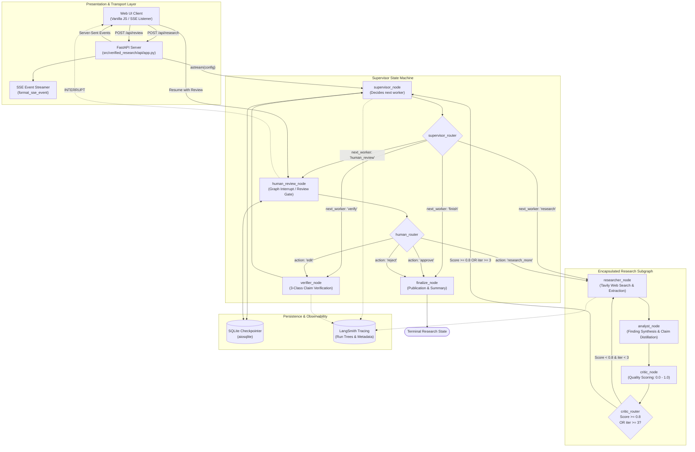

# Verified Research Agent

> A domain-agnostic, production-grade autonomous research and claim-verification engine built with LangGraph, LangChain, FastAPI, SQLite persistence, and LangSmith observability.

[](https://www.python.org/)
[](https://github.com/langchain-ai/langgraph)
[](https://fastapi.tiangolo.com/)
[]()
[](https://github.com/psf/black)

---

## 1. Executive Summary

Autonomous agentic research often suffers from hallucination, circular reasoning, stale web retrieval, and unverifiable assertions. The **Verified Research Agent** solves these challenges by treating factual research as a strictly verifiable state-machine problem. 

Rather than generating unbounded paragraphs of text, the agent:
1. **Discovers and extracts immutable evidence excerpts** directly from web and document sources.
2. **Decomposes research findings into testable atomic claims**, where every claim must explicitly cite one or more preserved evidence IDs.
3. **Independently verifies every claim** using a dedicated claim-level verification node evaluating against citations before human review.
4. **Enforces mandatory Human-in-the-Loop (HITL) checkpoints**, pausing the state machine to allow humans to approve, edit, request further research, or reject findings.
5. **Maintains ACID-durable state persistence** via SQLite, allowing long-running tasks to be paused, resumed, and audited across system restarts.
6. **Streams structured lifecycle events in real time** over Server-Sent Events (SSE) to an interactive, responsive web interface.

---

## 2. Core Architectural Principles

- **Zero-Uncited-Claim Invariant**: Claims cannot exist without backing evidence. An automated traceability layer rejects any claim missing an evidence attribution.
- **Hierarchical Orchestration**: A central **Supervisor** node manages macro transitions between specialized worker nodes, preventing monolithic reasoning bottlenecks.
- **Self-Correcting Cyclic Subgraph**: An encapsulated inner research loop (`Researcher` $\rightarrow$ `Analyst` $\rightarrow$ `Critic`) iterates up to 3 times, refining search queries until quality standards ($\ge 0.8$) are satisfied.
- **3-Class Verdict Verification**: Every claim is classified as `SUPPORTED`, `PARTIAL`, or `UNSUPPORTED` with strict grounding against textual citations.
- **Durable Multi-Turn Continuity**: Prior sources and evidence are retained across sessions on the same thread, reusing prior research when sufficient and executing delta searches when new topics arise.
- **Comprehensive Reliability**: Production fault tolerance featuring error classification (`TRANSIENT` vs `PERMANENT`), exponential backoff with full jitter, and circuit breaking.

---

## 3. High-Level Architecture Diagram



---

## 4. State Architecture & Data Contracts

All internal entities are defined as frozen Pydantic models with strict validation (`extra="forbid"`):

### Data Contract Hierarchy

```
Source (url, title, content)
  └── Evidence (source_id, text)
        └── Claim (text, evidence_ids: [evidence_id, ...])
              └── VerificationResult (verdict, confidence, reasoning)
```

- **`Source`**: Represents an external document or web URL.
- **`Evidence`**: Immutable text snapshot extracted from a Source. Downstream verification evaluates exclusively against this text snapshot, shielding the system from mutable external URLs.
- **`Claim`**: An atomic, falsifiable factual proposition derived from research findings.
- **`Finding`**: High-level synthesized theme referencing multiple sources.
- **`VerificationResult`**: Verifier outcome evaluating a Claim against its Evidence citations (`SUPPORTED`, `PARTIAL`, `UNSUPPORTED`).
- **`HumanReview`**: Human decision record (`approve`, `edit`, `research_more`, `reject`) including optional feedback or edited claims.

---

## 5. Supervisor Orchestration Engine

The Supervisor coordinates top-level execution without performing monolithic research or verification directly:
1. **Dynamic Task Dispatch**: Evaluates current state to determine whether research, verification, human review, or finalization is needed.
2. **Hard Loop Boundaries**: Enforces a strict upper bound of 12 supervisor transitions (`max_supervisor_steps = 12`) to eliminate infinite loops.
3. **Deterministic Audit Trail**: Each routing decision is recorded in `supervisor_decisions` with structured rationale.

---

## 6. Encapsulated Research Subgraph

The inner research engine executes an autonomous, self-evaluating cyclic loop:
1. **`researcher_node`**: Executes web searches via Tavily (or local determinism fallback) and extracts content snippets.
2. **`analyst_node`**: Synthesizes structured findings and extracts atomic claims citing preserved evidence.
3. **`critic_node`**: Evaluates findings on a 0.0 to 1.0 quality score, identifying topic gaps, weak findings, and citation deficiencies.
4. **`critic_router`**: If `quality_score < 0.8` and `iteration < 3`, formulates targeted follow-up queries and loops back to the researcher. Otherwise, yields control back to the Supervisor.

---

## 7. Claim-Level Verifier Engine

The Verifier validates every factual claim strictly against its cited evidence:
- **`SUPPORTED`**: The cited evidence directly and unequivocally proves the claim without unstated assumptions.
- **`PARTIAL`**: The cited evidence partially supports the claim, but key details or scopes are unproven or hedged.
- **`UNSUPPORTED`**: The cited evidence contradicts the claim, is irrelevant, or lacks sufficient factual specificity.

### Empirical Verifier Benchmark Results (`data/verifier_eval.json`)

| Metric | Score |
|---|---|
| **Accuracy** | **100.0%** |
| **Macro-F1** | **1.0000** |
| **SUPPORTED F1** | 1.0000 (Recall: 1.0, Precision: 1.0) |
| **PARTIAL F1** | 1.0000 (Recall: 1.0, Precision: 1.0) |
| **UNSUPPORTED F1** | 1.0000 (Recall: 1.0, Precision: 1.0) |

---

## 8. Human-in-the-Loop (HITL) Gate

The HITL gate interrupts graph execution before research concludes:
- **`approve`**: Accepts findings and advances to `finalize_node`.
- **`edit`**: Human modifies claim text or evidence citations. Edits are re-verified by `verifier_node`.
- **`research_more`**: Human provides feedback; graph routes back to `researcher_node` for an additional cycle (bounded $\le 3$).
- **`reject`**: Terminates workflow with explicit `REJECTED` status.

---

## 9. Follow-Up Research Sessions

The agent preserves session history across multi-turn interactions using the same `thread_id`:
- **Heuristic Sufficiency Check**: The `research_reuse_node` checks whether existing evidence is sufficient for follow-up questions.
- **`REUSE`**: Omits new web queries when prior evidence already contains the answer, saving latency and token budget.
- **`RESEARCH_MORE`**: Formulates targeted incremental queries when temporal shifts or new entities are introduced.

---

## 10. Reliability Engineering

- **Error Classification**: Distinguishes transient network errors from permanent configuration failures.
- **Full-Jitter Exponential Backoff**: Prevents thundering herds during API rate limits.
- **Circuit Breaker**: Automatically halts requests after consecutive failures.
- **Graceful Degradation**: Recovers cached evidence if network connectivity fails mid-stream.

---

## 11. Observability with LangSmith

- **Hierarchical Traces**: Root runs encompass the entire supervisor graph; child runs capture subgraph loops and LLM calls.
- **Structured Metadata**: Every run is tagged with `thread_id`, `supervisor_step`, `research_iteration`, and `agent_version`.
- **LangSmith Tracing Support**: Fully compatible with modern LangGraph 0.2+ and LangSmith v2 conventions.

---

## 12. Full-Stack Web UI & Real-Time Streaming

The presentation layer includes:
- **FastAPI Endpoints**:
  - `POST /api/research`: Initiate research sessions.
  - `GET /api/stream/{thread_id}`: Real-time Server-Sent Events (SSE).
  - `POST /api/review`: Submit human review decisions (`approve`, `edit`, `research_more`, `reject`).
  - `GET /api/threads/{thread_id}/state`: Retrieve current execution state.
- **Frontend Dashboard**:
  - Real-time step progress visualizer.
  - Interactive claim-by-claim verification table with color-coded badges (`SUPPORTED`, `PARTIAL`, `UNSUPPORTED`).
  - Source and evidence explorer with verbatim quote highlights.
  - Human review modal with inline claim editing.

---

## 13. System Evaluation Benchmark (Phase 15)

The comprehensive system evaluation suite was executed across 15 multi-dimensional research tasks defined in `data/system_eval.json`:

### Empirical Results Summary

| Evaluation Dimension | Empirical Result |
|---|---|
| **Total Evaluation Cases** | **15** |
| **Successful Completions** | **14 / 15 (93.3%)** |
| **Expected Human Rejections** | **1 / 15 (6.7%)** (Validates rejection guardrail) |
| **Permanent Failures** | **0 (0.0%)** |
| **Mean Citation Coverage** | **100.0%** (All claims cite verified evidence) |
| **Mean Verification Coverage** | **100.0%** (All claims evaluated by Verifier) |
| **Mean Supervisor Steps** | **4.53 steps** |
| **Mean Research Iterations** | **1.0 cycles** |
| **Mean Latency (Mock Mode)** | **0.013s** (Median: 0.01s) |
| **Automated Test Suite** | **328 passed** |

Detailed reports are available in:
- [FINAL_SYSTEM_EVALUATION.md](file:///d:/research-agent/reports/FINAL_SYSTEM_EVALUATION.md)
- [system_eval_results.json](file:///d:/research-agent/reports/system_eval_results.json)

---

## 14. Project Directory Structure

```text
verified-research-agent/
├── data/
│   ├── system_eval.json                   # 15-task end-to-end evaluation suite
│   └── verifier_eval.json                 # 20-case verifier benchmark
├── docs/
│   └── architecture/                      # 13 in-depth architecture specifications
│       ├── final-system-architecture.md   # Unified architectural design
│       └── ...
├── evaluation/
│   ├── evaluate_verifier.py               # Verifier benchmark runner
│   ├── metrics.py                         # Evaluation metrics (Accuracy, F1, Matrix)
│   ├── system_eval.py                     # System evaluation runner
│   └── system_eval_schemas.py             # Evaluation Pydantic schemas
├── frontend/
│   ├── app.js                             # Frontend state and event logic
│   ├── index.html                         # Responsive research dashboard
│   └── styles.css                         # UI styling and variables
├── reports/
│   ├── FINAL_SYSTEM_EVALUATION.md         # Final Phase 15 evaluation report
│   ├── system_eval_results.json           # Raw JSON evaluation metrics
│   └── verifier_eval_report.md            # Verifier benchmark report
├── src/
│   └── verified_research/
│       ├── api/                           # FastAPI app & SSE streamer
│       ├── config/                        # Settings & environment models
│       ├── graph/                         # Supervisor & Subgraph graph definitions
│       ├── models/                        # Domain models (Claim, Evidence, Source)
│       ├── observability/                 # LangSmith tracing & metadata
│       ├── reliability/                   # Backoff, circuit breaker & retries
│       └── verifier/                      # Claim verification engine
└── tests/                                 # 328 unit, integration, and invariant tests
    ├── production/                        # Production scenarios & fault injection
    └── ...
```

---

## 15. Quickstart & Installation

### Prerequisites
- Python 3.11, 3.12, or 3.13
- [`uv`](https://docs.astral.sh/uv/) package manager (recommended) or standard `pip`

### Setup

```bash
# Clone the repository
git clone https://github.com/dheerajgowd-18/research-agent.git
cd research-agent

# Install dependencies using uv
uv sync
```

### Environment Configuration

Create a `.env` file from the provided template:

```bash
cp .env.example .env
```

Configure your API keys:

```dotenv
# LLM Providers (Groq or OpenAI)
GROQ_API_KEY="gsk_..."
GROQ_MODEL="llama-3.3-70b-versatile"

# Search Provider (Tavily)
TAVILY_API_KEY="tvly-..."

# LangSmith Observability (Optional)
LANGSMITH_TRACING="true"
LANGSMITH_API_KEY="lsv2_..."
LANGSMITH_PROJECT="verified-research-agent"

# Server Configuration
PORT=8000
HOST="127.0.0.1"
```

---

## 16. Running the Application

### Start the FastAPI Server & Web UI

```bash
# Run server using uv
uv run uvicorn verified_research.api.app:app --host 127.0.0.1 --port 8000 --reload
```

Open your browser to:
- **Interactive UI**: `http://127.0.0.1:8000/`
- **Swagger API Docs**: `http://127.0.0.1:8000/docs`

---

## 17. Running Tests & Evaluations

### Run Complete Test Suite (328 tests)

```bash
uv run pytest
```

### Run Phase 15 System Evaluation

```bash
uv run python -m evaluation.system_eval --dataset data/system_eval.json --output reports/system_eval_results.json --report reports/FINAL_SYSTEM_EVALUATION.md
```

### Run Phase 6 Verifier Benchmark

```bash
uv run python -m evaluation.evaluate_verifier --dataset data/verifier_eval.json
```

---

## 18. Limitations & Production Considerations

1. **Live Web Search Shifts**: Live web search results fluctuate over time. Evaluation benchmarks support deterministic mock workers for offline continuous integration.
2. **In-Memory Event Queues**: In single-instance deployment, streaming buffers are kept in-memory. For horizontal multi-instance scaling, a shared pub/sub broker (e.g., Redis) is recommended.
3. **Token Usage Bounding**: Production deployments should configure strict max token bounds per research request in `settings.py`.

---

## 19. License

This project is licensed under the Apache 2.0 License.
