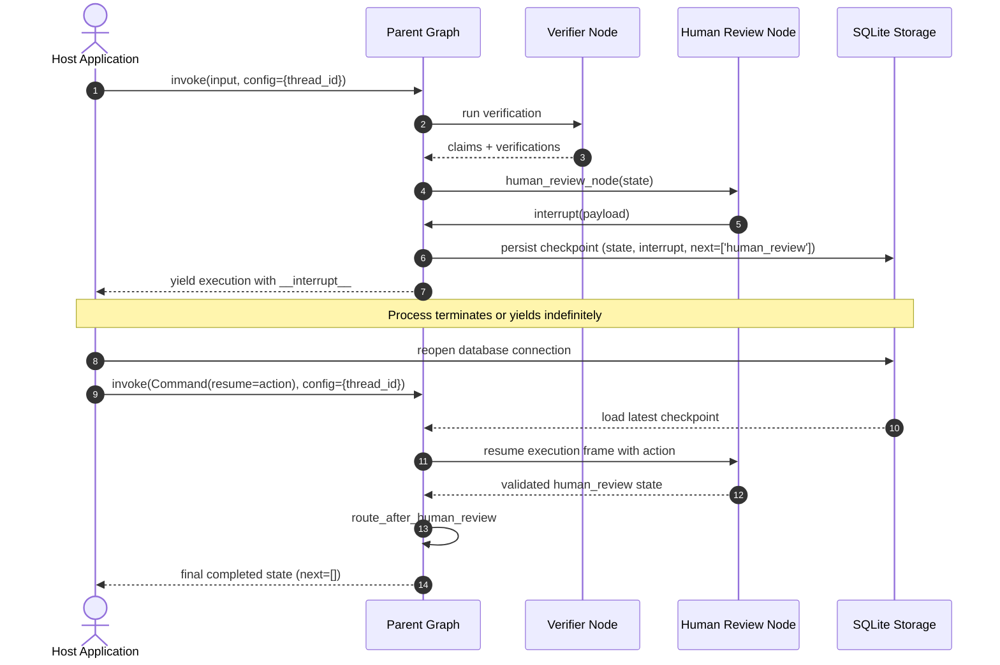

# Architecture Design: Checkpointing & State Persistence

This document details the architectural rationale, design decisions, execution flow, thread isolation mechanics, serialization guarantees, and recovery procedures for the **Checkpointing and Persistence** subsystem in the **Verified Research Agent**.

---

## 1. Why Checkpointing is Required

In naive AI agent execution loops, state exists strictly in volatile process memory (`RAM`). When graph execution halts—whether due to a human review `interrupt()`, a network timeout, or application maintenance—all accumulated research, retrieved sources, synthesized findings, atomic claims, and verification verdicts are lost forever.

Checkpointing solves three fundamental problems:
1. **Durable Pause & Asynchronous Human Review**: Human reviewers do not respond within milliseconds. A review might take minutes, hours, or days. Checkpointing frees server resources and worker threads while awaiting human input.
2. **Crash & Restart Fault Tolerance**: If a process crashes, an operating system restarts, or a cloud node is rescheduled, a persisted graph can resume from its last validated checkpoint without re-running costly upstream research.
3. **Auditability & Provenance**: State transitions, inputs, and intermediate outputs are preserved in durable storage, enabling reproducible post-hoc inspection of agent behavior.

---

## 2. In-Memory Execution vs. Persistent Execution

| Dimension | In-Memory Execution (`MemorySaver`) | Persistent Execution (`SqliteSaver`) |
| :--- | :--- | :--- |
| **Storage Medium** | Python process heap (RAM) | Durable disk file (`.db` / SQLite WAL) |
| **Process Boundary** | State dies when process exits | State survives process exit and OS reboot |
| **Concurrency** | Single-process only | Multi-process readable with thread safety |
| **Recovery Mechanism** | Impossible once process terminates | Load by `thread_id` and resume anytime |
| **Production Readiness** | Development/unit tests only | Local apps, embedded tools, single-node deployments |

While `MemorySaver` was sufficient for initial development and testing of graph transitions in Phase 7, Phase 8 elevates the pipeline to persistent execution capable of surviving complete process restarts.

---

## 3. Thread IDs: Logical Execution Boundaries

A `thread_id` is an opaque string identifier supplied by the host application through LangGraph's runtime configuration:

```python
config = {"configurable": {"thread_id": "research-session-001"}}
```

### Architectural Guarantees of Thread IDs
1. **Logical Isolation**: Checkpoints from `thread-001` and `thread-002` are stored in the same database but are partitioned by `thread_id`. Queries or resumes targeting `thread-001` cannot read, mutate, or corrupt `thread-002`.
2. **External Control**: The graph implementation never hard-codes a thread ID. The caller controls session lifetimes, enabling multi-user and multi-tenant architectures.
3. **Execution Forking & History**: Thread IDs allow inspecting historical state checkpoints (`get_state_history`) or resuming from specific checkpoint IDs.

---

## 4. The Role of the SQLite Checkpointer

SQLite was selected as the persistence backend for Phase 8 to balance zero-infrastructure simplicity with ACID reliability:

- **Self-Contained**: No external server, daemon, or network configuration required.
- **Embedded Performance**: Operates via local disk I/O with millisecond read/write latency.
- **ACID Transactions**: Guarantees atomic writes of checkpoint states and write channels.
- **Clean Architecture Boundary**: The graph definition in `src/verified_research/graph/graph.py` accepts any LangGraph `BaseCheckpointSaver`. SQLite persistence is isolated in `src/verified_research/persistence/sqlite.py`, allowing drop-in replacement with PostgreSQL or Redis in future phases.

---

## 5. Interaction with Human Review (`interrupt` / `resume`)

Phase 7 introduced `interrupt()` inside `human_review_node`. In Phase 8, this interrupt seamlessly triggers persistence:



1. When `interrupt()` is called, LangGraph captures the active task, checkpoint payload, and channel versions, saving them to SQLite.
2. The graph halts and returns control to the caller.
3. Upon resume with `Command(resume=...)`, LangGraph loads the checkpoint associated with the `thread_id`, injects the resumed value into the interrupted node, and proceeds down the conditional edges.

---

## 6. Restart Recovery Workflow

The system provides a verified recovery sequence across genuine process boundaries:

```
[ Process A ]
run graph
   ↓
progress through Research & Verifier
   ↓
human_review interrupts
   ↓
checkpoint written to SQLite disk file
   ↓
Process A terminates (OS exits process, RAM freed)

[ Process B (New Python Process) ]
reopen SQLite database file
   ↓
compile graph with checkpointer
   ↓
inspect state for thread_id -> confirms next == ('human_review',)
   ↓
graph.invoke(Command(resume={'action': 'approve'}), thread_id)
   ↓
graph resumes from human_review WITHOUT re-executing research
   ↓
concludes at END
```

This restart boundary is verified by automated subprocess tests in `tests/test_persistence.py`.

---

## 7. Checkpointing vs. Conversational Memory

A crucial distinction must be maintained:

| Attribute | Checkpointing (Phase 8) | Conversational Memory (Deferred) |
| :--- | :--- | :--- |
| **Purpose** | Execution state persistence & fault recovery | Multi-turn dialogue context & user chat history |
| **Granularity** | Point-in-time snapshot of the execution graph | Semantic history of user/assistant messages |
| **Scope** | State machine channels (`claims`, `sources`, etc.) | Semantic memory buffers, summary memory, vector recall |
| **Resumption Target** | Next unexecuted node in the DAG | Prompt injection for subsequent user conversational turns |

Phase 8 implements **checkpointing**, NOT conversational memory. Conversational memory is intentionally deferred to future roadmap phases.

---

## 8. Serialization & State Invariants

State persistence requires serializing arbitrary Python domain models into binary storage (Msgpack / JSON).

### Domain Type Allowlist
To prevent unsafe deserialization warnings or failures with `ormsgpack`, all domain models are registered in `CHECKPOINT_ALLOWED_TYPES`:
```python
CHECKPOINT_ALLOWED_TYPES = (
    ("verified_research.models.research", "Source"),
    ("verified_research.models.research", "Finding"),
    ("verified_research.models.research", "Evidence"),
    ("verified_research.models.research", "Claim"),
    ("verified_research.models.research", "AnalystOutput"),
    ("verified_research.models.research", "Critique"),
    ("verified_research.models.research", "VerificationResult"),
    ("verified_research.models.research", "HumanReview"),
)
```

### State Cleanliness Rules
1. **No Unserializable Objects**: No database connection handles, sockets, lambda functions, or active file descriptors in `ResearchState`.
2. **Pydantic Model Integrity**: All models (`Claim`, `Evidence`, `HumanReview`) are frozen, validated, and reconstructable with exact typing.
3. **Deterministic State Reconstitution**: Restoring a checkpoint yields identical Pydantic model instances matching pre-interruption state.

---

## 9. Architectural Limitations

1. **Local Concurrency**: SQLite file locking is suited for single-process workers or small local deployments. High-throughput distributed workers require client-server databases (e.g. PostgreSQL).
2. **External Side-Effect Idempotency**: Checkpointing persists *graph state*, not external side effects. If a node sends an external email or charges a credit card before interrupting, checkpoint restoration does not undo or automatically idempotently protect external systems.
3. **No Retroactive Code Migration**: If graph node definitions change drastically between checkpoint write and resume, state schema migrations may be needed.

---

## 10. Deferred Work

The following capabilities are deliberately out of scope for Phase 8:
- Conversational chat memory
- Supervisor multi-agent orchestration
- Distributed PostgreSQL checkpointer
- Automated retry and exponential backoff policies
- LangSmith tracing integration
- Web UI and frontend dashboards
- Downstream Report Writer node
