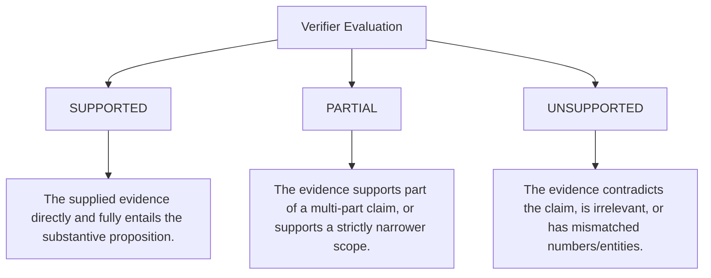
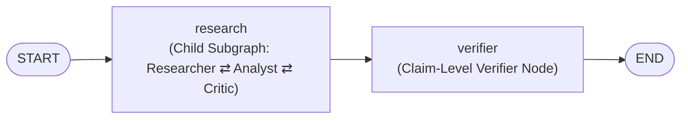

# Architecture Design: Claim-Level Verifier

This document details the architectural rationale, design decisions, verification taxonomy, failure modes, prompt engineering principles, and graph composition for the **Claim-Level Verifier** in the **Verified Research Agent**.

---

## 1. Verifier Problem Statement: Grounding vs. Universal Truth

The claim verifier answers one specific question:
> **"Does this supplied evidence support this supplied claim?"**

It does **NOT** answer:
> *"Is this claim universally true in the real world?"*

### Why Grounding $\neq$ Universal Truth
1. **Scope of Authority**: In an agentic research system, truth is relative to the retrieved and cited knowledge base. If an authoritative scientific paper claims a novel battery density of 500 Wh/kg, the system must verify whether the agent faithfully represents what the paper stated, not independently determine the laws of electrochemistry.
2. **Epistemic Isolation**: A claim may be true in reality (e.g., *"Paris is the capital of France"*), but if the cited evidence excerpt discusses quantum mechanics, the verdict with respect to that cited evidence is strictly **`UNSUPPORTED`**.
3. **Auditability**: Grounding produces deterministic audit trails. Human reviewers, regulators, or domain experts can inspect:
   $$\text{Claim} \xrightarrow{\text{cites}} \text{Evidence Excerpt} \xrightarrow{\text{verified by}} \text{Verdict} + \text{Reasoning}$$
   If verification depended on undefined model latent memory, auditability would vanish.

---

## 2. Why the Verifier Must NOT Search the Web

A common anti-pattern in naive LLM architectures is allowing verifier nodes to execute new web searches or tool calls. In this architecture, search inside the verifier is **strictly prohibited** for the following architectural reasons:

1. **Role Separation**: The `Researcher` agent is responsible for information discovery; the `Verifier` is responsible for factual entailment and evidentiary grounding. Blurring these responsibilities creates circular dependencies.
2. **Goal Drift & Endless Loops**: If a verifier searches the web when a claim is unsupported, it risks drifting into an unbounded discovery loop rather than evaluating the analyst's synthesis.
3. **Masking Generation Failures**: If an analyst hallucinates a claim unsupported by the retrieved evidence, having the verifier find new evidence masks the hallucination instead of detecting it.
4. **Latency and Token Explosion**: Web search is expensive (network I/O, HTML parsing, content extraction). Entailment checking over pre-extracted snapshots is fast, bounded, and token-efficient.

---

## 3. Structural Traceability Validation vs. Semantic Verification

Our architecture enforces a two-tier verification boundary:

| Dimension | Structural Traceability Validation | Semantic Claim Verification |
| :--- | :--- | :--- |
| **Execution Layer** | Python deterministic code (`validate_traceability()`) | Verifier Node / LLM Entailment (`ClaimVerifierService`) |
| **Verification Target** | Graph integrity, foreign keys, ID resolution | Natural language semantic entailment |
| **Questions Answered** | Do cited `evidence_id`s and `source_id`s exist? Are snapshots non-empty? | Does the excerpt actually mean what the claim asserts? |
| **Cost & Latency** | 0 tokens, sub-millisecond | LLM token inference |
| **Guarantees** | Referential integrity, no orphan citations | Truthfulness with respect to cited excerpt |

A claim can pass structural validation (valid IDs, preserved excerpts) while failing semantic verification (completely unsupported or contradicted by the excerpt).

---

## 4. Verdict Taxonomy

The verifier outputs one of three strictly defined verdicts:



### 1. `SUPPORTED`
The evidence directly, fully, and factually entails the substantive proposition of the claim.
- All factual predicates, numerical quantities, temporal frames, and named entities in the claim are substantiated by the cited excerpt.
- Minor stylistic paraphrase is acceptable as long as semantic meaning is unchanged.

### 2. `PARTIAL`
The evidence supports a subset of the claim, or the claim overstates the evidence.
- **Scope Overclaim**: The claim asserts a global launch, but evidence only confirms North America and Europe.
- **Hedging Overclaim**: The evidence says "early studies suggest potential efficacy," but the claim asserts "proven efficacy."
- **Multi-Proposition Conjunction**: The claim makes two assertions ($A \land B$), but the cited evidence only supports $A$.

### 3. `UNSUPPORTED`
The evidence fails to support the claim. This includes:
- **Direct Contradiction**: Evidence says the clinical trial failed; claim says it succeeded.
- **Irrelevance**: Evidence discusses battery life; claim discusses display resolution.
- **Numeric Mismatch**: Evidence states 84.2%; claim states 94.2%.
- **Entity Mismatch**: Evidence names Company Alpha; claim attributes action to Company Gamma.
- **Temporal Mismatch**: Evidence states a policy expired in 2020; claim asserts it is currently active.

---

## 5. Prompt Engineering for Claim Verification

The prompt design adheres to strict Natural Language Inference (NLI) principles:

### Core Prompt Elements
1. **Epistemic Barrier**: Explicit instruction that the verifier is an objective auditor and must not use prior world knowledge.
2. **Explicit Verification Rules**: Detailed breakdown of what constitutes SUPPORTED, PARTIAL, and UNSUPPORTED.
3. **Structured Context Presentation**:
   ```
   CLAIM TO EVALUATE [claim_001]:
   <claim text>

   SUPPLIED EVIDENCE (2 items):
   EVIDENCE 1 [ev_001] (Source: src_001):
   <evidence excerpt 1>

   EVIDENCE 2 [ev_002] (Source: src_002):
   <evidence excerpt 2>
   ```
4. **Structured Output Enforcement**: Output schema enforced via Pydantic (`VerificationResult` with fields `claim_id`, `verdict`, `confidence`, `reasoning`, `evidence_ids`).

---

## 6. Edge Case Taxonomy & Handling

| Category | Evidence Example | Claim Example | Correct Verdict | Rationale |
| :--- | :--- | :--- | :--- | :--- |
| **Paraphrase** | *"The merger was finalized following regulatory approval in Brussels."* | *"EU regulators approved the merger, allowing it to complete."* | `SUPPORTED` | True semantic equivalence; Brussels regulatory body represents EU approval. |
| **Partial Support** | *"Product A launched in North America and Europe."* | *"Product A launched globally across North America, Europe, and Asia."* | `PARTIAL` | Asia and global scope are unverified, but North America and Europe are verified. |
| **Direct Contradiction** | *"The clinical trial failed to achieve its primary endpoint."* | *"The clinical trial successfully achieved its primary endpoint."* | `UNSUPPORTED` | Antonymous predicate directly refutes claim. |
| **Irrelevant Evidence** | *"The battery operates for 18 hours under typical usage."* | *"The phone features an OLED display."* | `UNSUPPORTED` | Zero topical overlap between cited text and claim proposition. |
| **Numeric Mismatch** | *"The model achieved 84.2% accuracy on the benchmark."* | *"The model achieved 94.2% accuracy on the benchmark."* | `UNSUPPORTED` | Quantifier alteration falsifies the claim. |
| **Temporal Mismatch** | *"The policy was in effect from 2018 to 2020."* | *"The policy is currently active."* | `UNSUPPORTED` | Expired temporal frame contradicts ongoing state. |
| **Entity Mismatch** | *"Company Alpha acquired Company Beta."* | *"Company Gamma acquired Company Beta."* | `UNSUPPORTED` | Actor attribution error. |
| **Hedging / Scope Mismatch** | *"Early studies suggest the compound may inhibit tumor growth."* | *"The compound definitely cures cancer."* | `UNSUPPORTED` | Tentative exploratory hypothesis escalated to definitive cure. |

---

## 7. Multiple Evidence Combination

Many complex claims cannot be verified by a single sentence. The architecture explicitly supports multi-evidence verification:

$$\text{Claim}(C) \leftarrow \{ E_1, E_2 \}$$

For example:
- **Evidence 1 (`ev_010_a`)**: *"Model was trained on 15T tokens."*
- **Evidence 2 (`ev_010_b`)**: *"Training took 24 days on 1024 GPUs."*
- **Claim (`claim_010`)**: *"The model was trained on 15T tokens across 1024 GPUs."*

### Resolution Mechanics:
1. `verifier_node` iterates over `claim.evidence_ids`.
2. Gathers and validates all cited evidence items from `state["evidence"]`.
3. Concatenates all evidence items into distinct labeled blocks in the prompt.
4. The model evaluates whether the joint conjunction ($\bigwedge_{i} E_i$) entails the claim.
5. Invariant check ensures all cited evidence IDs are recorded on the returned `VerificationResult`.

---

## 8. Failure Modes of LLM Verifiers

LLM-based verifiers are prone to specific cognitive biases that our architecture counters:

1. **Prior Knowledge Leakage**:
   - *Problem*: The model "knows" that Paris is in France and marks an uncited claim `SUPPORTED` despite empty or irrelevant evidence.
   - *Mitigation*: Explicit negative constraints in system prompt: *"Base your verdict EXCLUSIVELY on the supplied evidence excerpts. Do NOT use outside world knowledge."*
2. **Sycophancy & Lenience Bias**:
   - *Problem*: Tendency to agree with the claim or assume the analyst "meant well."
   - *Mitigation*: Strict taxonomy definitions penalizing over-generalization and classifying partial matches as `PARTIAL` rather than `SUPPORTED`.
3. **Length Bias**:
   - *Problem*: Mistaking longer, wordier evidence excerpts for stronger proof.
   - *Mitigation*: Pre-chunked, focused evidence snapshots rather than full document dumping.
4. **Negation Blindness**:
   - *Problem*: Missing subtle negations (*"failed to show"*, *"did not observe"*).
   - *Mitigation*: Explicit instruction in prompt to inspect negation and modal qualifiers.

---

## 9. Confidence Calibration

The `confidence` float field in `VerificationResult` ($[0.0, 1.0]$) represents:
$$\textbf{Model Certainty in Entailment Decision} \neq \textbf{Empirical System Accuracy}$$

- **What It Measures**: The LLM's subjective certainty that its verdict aligns with the provided definitions given the text clarity.
- **What It Does NOT Measure**: Empirical precision, recall, or historical benchmark accuracy (which requires gold-standard test sets in offline evaluation).
- **Architectural Utility**: In subsequent human-in-the-loop phases, low-confidence verdicts ($\text{confidence} < 0.70$) can automatically route to human review queues.

---

## 10. Parent Graph Integration & Composition

The parent graph integrates the verifier sequentially after the research loop completes:



### Execution Flow:
1. **START** passes initial `ResearchState` (`{"question": "..."}`).
2. **`research` (subgraph)** runs iteratively until critique passes or max iterations ($N=3$) is reached. Outputs `sources`, `findings`, `claims`, `evidence`.
3. **`verifier` (node)** takes state, resolves evidence for each claim, executes entailment evaluation, and writes `verification_results`.
4. **END** receives fully verified, traceable research state.

---

## 11. State Changes: `verification_results`

`ResearchState` in `src/verified_research/graph/state.py` is extended with:

```python
class ResearchState(TypedDict, total=False):
    question: str
    sources: list[Source]
    findings: list[Finding]
    research_iteration: int
    critique: Critique
    evidence: list[Evidence]
    claims: list[Claim]
    verification_results: list[VerificationResult]  # Added in claim verifier phase
```

The verifier does not overwrite or mutate `claims` or `evidence`. State accumulation follows append-only, immutable semantics.

---

## 12. Checkpointing Readiness

The state design is completely checkpoint-ready:
1. **JSON Serializable**: `VerificationResult` is a pure Pydantic model with primitive and string fields.
2. **Deterministic Schemas**: Uses typed models (`VerdictType = Literal["SUPPORTED", "PARTIAL", "UNSUPPORTED"]`).
3. **Inspection Boundary**: When a checkpointer (e.g., `MemorySaver` or `SqliteSaver`) is introduced in future phases, the boundary between `research` and `verifier` or after `verifier` can pause for human inspection without schema conversion errors.

---

## 13. Subgraph vs. Parent Node: Why the Verifier Lives in the Parent

A crucial architectural decision was placing `verifier` in the parent graph rather than inside the research subgraph:

| Consideration | Inside Research Subgraph | In Parent Graph (Chosen) |
| :--- | :--- | :--- |
| **Separation of Concerns** | Conflates discovery/critique with formal verification. | Clean separation: Subgraph discovers; Parent verifies. |
| **Cycle Semantics** | Would run on every intermediate iteration, wasting tokens on discarded claims. | Runs once on the finalized, approved claim set. |
| **Audit Boundary** | Internal to child graph; invisible to parent routing. | Visible at parent graph level; enables future human review routing. |
| **Encapsulation** | Violates child subgraph single responsibility. | Maintains child subgraph as a reusable discovery module. |

---

## 14. Node Contract: Inputs, Outputs, Invariants

### Function Signature:
```python
def verifier_node(state: ResearchState) -> dict[str, list[VerificationResult]]: ...
```

### Contract:
- **INPUT**:
  - `state.get("claims", [])`: List of `Claim` objects.
  - `state.get("evidence", [])`: List of `Evidence` objects.
- **OUTPUT**:
  - `{"verification_results": list[VerificationResult]}`
- **INVARIANTS**:
  1. **Referential Integrity**: Every `evidence_id` in `claim.evidence_ids` must exist in `state["evidence"]`. If missing, raises `UnknownEvidenceError` before calling LLM.
  2. **1:1 Cardinality**: Exactly one `VerificationResult` is produced for each `Claim` in state:
     $$\text{len}(\text{verification\_results}) == \text{len}(\text{claims})$$
  3. **ID Preservation**: `result.claim_id` must match `claim.claim_id`, and `result.evidence_ids` must match `claim.evidence_ids`.
  4. **Empty State Safety**: If `claims` is empty or missing, immediately returns `{"verification_results": []}` without LLM invocation.

---

## 15. Extensibility to Future Verification Strategies

The verifier is decoupled via the `VerifierService` protocol:

```python
class VerifierService(Protocol):
    def verify_claim(self, claim: Claim, evidence_items: list[Evidence]) -> VerificationResult:
        ...
```

This protocol abstraction enables plug-and-play future verification engines:
- **NLI Classifier**: Small, fast cross-encoder (e.g., RoBERTa-large-MNLI) for sub-millisecond entailment checks.
- **Multi-LLM Jury / Ensemble**: Running multiple models (e.g., Claude + GPT-4 + Gemini) and aggregating votes.
- **Rule-based Verifier**: Exact pattern matching for structured financial or numerical claims.
- **Code Execution Verifier**: Running Python REPL for math and statistical calculations.

---

## 16. Complete Current Pipeline Architecture

```
START
  │
  ▼
┌─────────────────────────────────────────────────────────────┐
│ research (Child Subgraph)                                   │
│                                                             │
│   START ──► researcher ──► analyst ──► critic               │
│                 ▲                         │                 │
│                 │      [weak & iter < 3]  │                 │
│                 └─────────────────────────┴──► END          │
│                                      [good | max_iter]      │
└─────────────────────────────────────────────────────────────┘
  │
  │  State contains: sources, findings, evidence, claims
  ▼
┌─────────────────────────────────────────────────────────────┐
│ verifier (Parent Graph Node)                                │
│                                                             │
│   For each claim:                                           │
│     1. Resolve claim.evidence_ids in state["evidence"]      │
│     2. Check referential integrity                          │
│     3. Evaluate entailment: SUPPORTED | PARTIAL | UNSUPPORTED│
│     4. Emit VerificationResult(claim_id, verdict, ...)       │
└─────────────────────────────────────────────────────────────┘
  │
  │  State contains: ..., verification_results
  ▼
 END
```
