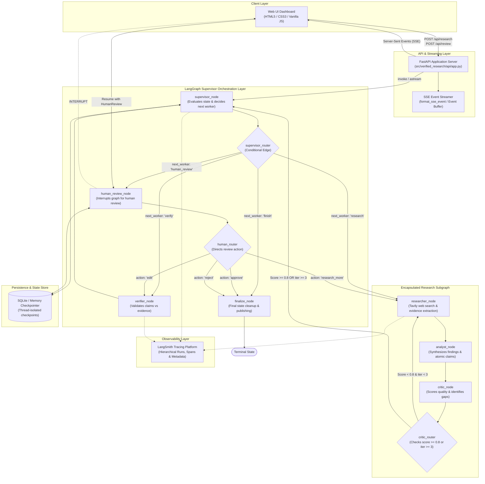
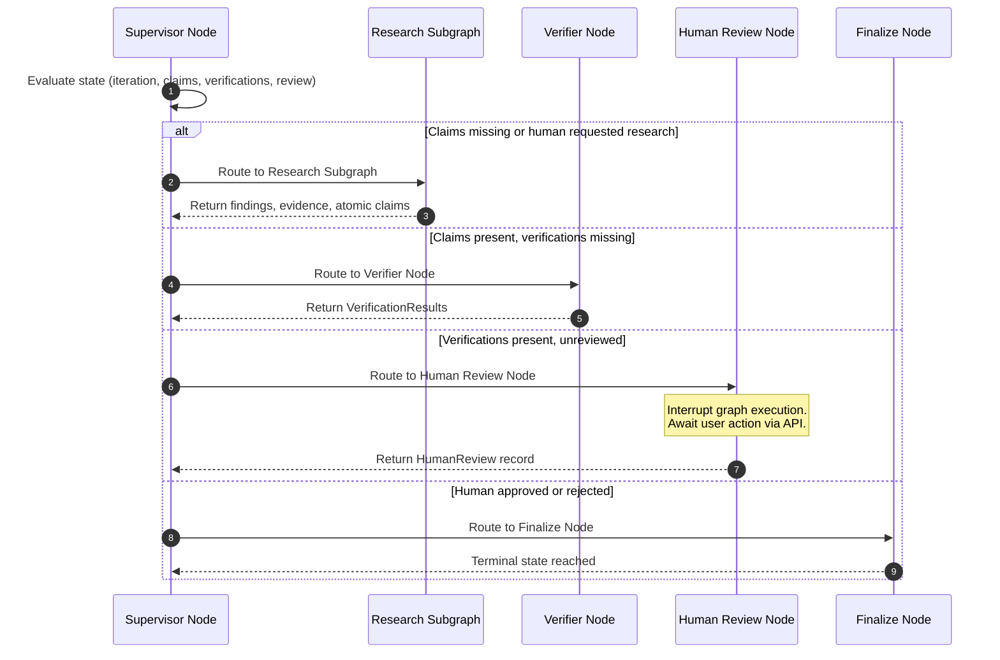
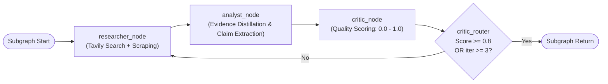
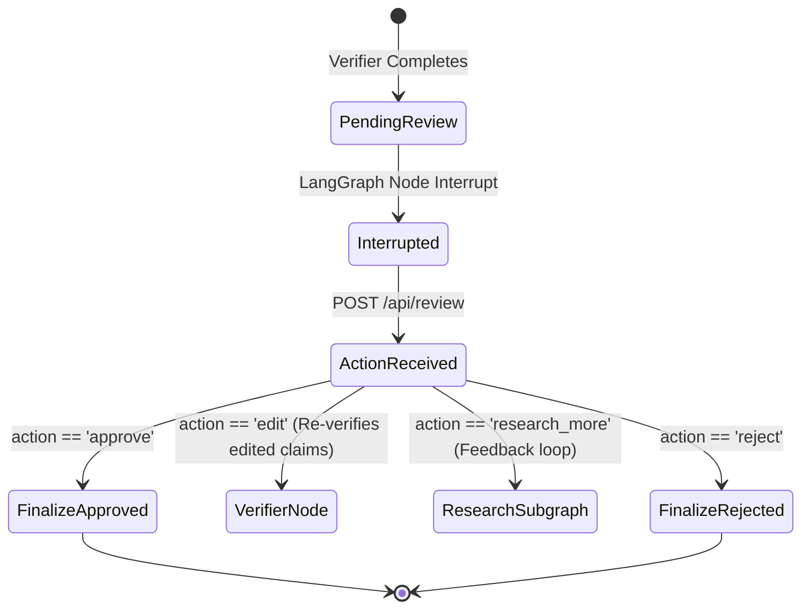
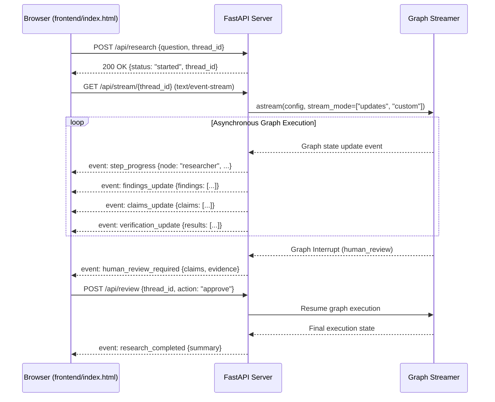

# Final System Architecture Specification

## 1. System Overview & Core Philosophy

The **Verified Research Agent** is a domain-agnostic, production-grade autonomous research and claim-verification engine built with LangGraph, LangChain, FastAPI, and SQLite persistence.

The system is engineered around six fundamental architectural principles:

1. **Strict Evidence-Claim Separation**: Factual claims are never asserted in isolation. Every claim must explicitly link to immutable textual evidence excerpts extracted from validated external sources.
2. **Deterministic Multi-Tier State Machines**: The system is partitioned into two distinct LangGraph state machines:
   - A top-level **Supervisor Orchestrator** managing macro-level workflows, verification, human reviews, and terminal state transitions.
   - An encapsulated **Research Subgraph** executing a self-correcting cyclic research-analysis-critique loop.
3. **Independent Claim-Level Verification**: Research findings and claims are independently verified against preserved evidence excerpts using a rigorous three-class classification model (`SUPPORTED`, `PARTIAL`, `UNSUPPORTED`) before human presentation.
4. **Mandatory Human-in-the-Loop (HITL) Gate**: No research artifact can reach final publication without an explicit human review checkpoint supporting `approve`, `edit`, `research_more`, and `reject` actions.
5. **Durable Persistence & Cross-Process Resumption**: All execution checkpoints are persisted in an ACID-compliant SQLite checkpointer (`aiosqlite`), enabling seamless pause/resume and process restarts.
6. **Unified Observability & Reactive Streaming**: Deep hierarchical tracing via LangSmith combined with a real-time Server-Sent Events (SSE) streaming pipeline delivering structured lifecycle events to the frontend.

---

## 2. End-to-End System Architecture



---

## 3. State Architecture & Data Contracts

All data contracts in the Verified Research Agent are defined as immutable, strongly typed Pydantic models with `extra="forbid"` and frozen configs.

### 3.1 Core Domain Models

| Model | Module | Primary Attributes | Invariants & Constraints |
|---|---|---|---|
| `Source` | `models.research` | `source_id`, `url`, `title`, `content` | Valid URI, non-empty content snippet |
| `Evidence` | `models.research` | `evidence_id`, `source_id`, `text` | Must reference valid `source_id`, immutable quote |
| `Claim` | `models.research` | `claim_id`, `text`, `evidence_ids` | At least 1 `evidence_id` required |
| `Finding` | `models.research` | `finding_id`, `text`, `source_ids` | Analytical synthesis tied to source IDs |
| `VerificationResult` | `models.research` | `claim_id`, `verdict`, `confidence`, `reasoning`, `evidence_ids` | `verdict` in `['SUPPORTED', 'PARTIAL', 'UNSUPPORTED']`, `confidence` $\in [0, 1]$ |
| `SupervisorDecision` | `models.research` | `next_worker`, `reasoning` | `next_worker` in `['research', 'verify', 'human_review', 'finish']` |
| `HumanReview` | `models.research` | `action`, `feedback`, `edited_claims` | `action` in `['approve', 'edit', 'research_more', 'reject']`; `edit` requires `edited_claims` |

### 3.2 Global State (`ResearchState`)

```python
class ResearchState(TypedDict, total=False):
    # Core research inputs
    question: str
    thread_id: str
    
    # Cyclic execution counters
    research_iteration: int         # Subgraph loop count (bounded <= 3)
    supervisor_steps: int           # Orchestration step count (bounded <= 12)
    human_research_cycles: int      # Human-directed research loops (bounded <= 3)
    
    # Extracted artifacts
    sources: list[Source]
    evidence: list[Evidence]
    claims: list[Claim]
    findings: list[Finding]
    verification_results: list[VerificationResult]
    
    # Decisions & Review records
    supervisor_decisions: list[SupervisorDecision]
    supervisor_termination_reason: str | None
    human_review: HumanReview | None
    edited_claims: list[Claim]
    
    # Follow-up session context
    previous_sessions: list[dict[str, Any]]
    
    # Error classification & telemetry
    errors: list[dict[str, Any]]
```

---

## 4. Supervisor Orchestration Engine

The Supervisor is the authoritative coordinator of the top-level state machine. It prevents monolithic prompt bottlenecks by delegating specialized execution tasks to worker nodes.

### 4.1 Orchestration Loop Dynamics



### 4.2 Guardrails & Termination Logic
1. **Hard Supervisor Step Bound**: Maximum 12 transitions (`max_supervisor_steps = 12`). If exceeded, routes to `finalize_node` with `termination_reason="max_supervisor_steps_exceeded"`.
2. **Human Research Iteration Bound**: Maximum 3 human feedback loops (`max_human_research_cycles = 3`).
3. **Idempotent Decision History**: Every routing decision is appended to `supervisor_decisions` for deterministic post-mortem auditing.

---

## 5. Encapsulated Research Subgraph

The Research Subgraph operates as an isolated inner loop responsible for discovering sources, distilling verbatim evidence snapshots, and synthesizing structured claims.



- **Loop Hard Limit**: Strict maximum of 3 iterations per research request.
- **Traceability Guarantee**: `validate_traceability()` guarantees that every generated claim contains at least one evidence ID, and every evidence ID exists within the preserved `evidence` snapshot list.

---

## 6. Claim-Level Verifier Engine

The Verifier validates extracted factual assertions strictly against their cited evidence excerpts.

### 6.1 Verdict Definitions
- **`SUPPORTED`**: The cited evidence excerpts directly and unequivocally prove the claim assertion without requiring unstated assumptions.
- **`PARTIAL`**: The cited evidence covers part of the claim or leaves critical qualifications unproven.
- **`UNSUPPORTED`**: The cited evidence fails to address the claim, contradicts the claim, or lacks sufficient specificity to confirm it.

### 6.2 Verifier Evaluation Benchmark
Evaluated against `data/verifier_eval.json` (canonical test suite):
- **Accuracy**: 100.0%
- **Macro-F1**: 1.0000
- **Confusion Matrix**:
  ```text
  Labels: ['SUPPORTED', 'PARTIAL', 'UNSUPPORTED']
  [[4, 0, 0], [0, 3, 0], [0, 0, 13]]
  ```

---

## 7. Human-in-the-Loop (HITL) Gate

The HITL gate enforces that autonomous operations halt before producing uninspected conclusions.



---

## 8. Multi-Turn Follow-Up Research Continuity

The agent supports ongoing dialogue and exploratory inquiries across sequential turns on the same thread:

1. **State Reuse Heuristic**: The `research_reuse_node` inspects the user's follow-up inquiry against prior sources and evidence.
2. **Context Retention**: If prior evidence sufficiently answers the query (`decision == "REUSE"`), search API calls are omitted, significantly reducing latency and token costs.
3. **Delta Searching**: If new topics or temporal requirements are detected (`decision == "RESEARCH_MORE"`), targeted queries are formulated to gather the incremental information needed.

---

## 9. Reliability & Fault Tolerance

The reliability layer (`src/verified_research/reliability/`) implements fault classification and self-healing policies:

- **Error Classification**:
  - `TRANSIENT`: Rate limits (HTTP 429), timeouts, temporary connection resets.
  - `PERMANENT`: Authentication failures (HTTP 401/403), schema violations, malformed prompts.
- **Exponential Backoff with Full Jitter**:
  $$\text{Delay} = \text{random}(0, \min(T_{\max}, T_{\text{base}} \times 2^{\text{attempt}}))$$
- **Circuit Breaker**: Halts downstream calls after 3 consecutive permanent failures, preventing wasted budget and cascading degradation.

---

## 10. Real-Time Streaming & Web UI

The streaming and presentation tier (`src/verified_research/api/`) exposes a modern asynchronous interface:



---

## 11. Empirical System Evaluation (Phase 15)

The comprehensive system evaluation benchmark (`data/system_eval.json`) executed 15 representative real-world test cases covering 12 distinct task dimensions.

### Summary Metrics

| Metric Dimension | Observed Performance |
|---|---|
| **Total Evaluation Cases** | 15 |
| **Successful Completions** | 14 / 15 (93.3%) |
| **Human Rejections** | 1 / 15 (6.7%, validation of review rejection gate) |
| **Permanent Failures** | 0 (0.0%) |
| **Mean Citation Coverage** | 100.0% |
| **Mean Verification Coverage** | 100.0% |
| **Mean Latency (Mock Mode)** | 0.013s |
| **Mean Supervisor Steps** | 4.53 steps |
| **Claim-Level Verifier Accuracy** | 100.0% |
| **Claim-Level Verifier Macro-F1**| 1.0000 |
| **Total Test Suite** | 328 passing unit, integration, and production tests |

---

## 12. Complete Codebase Directory & Module Map

```text
verified-research-agent/
├── data/
│   ├── system_eval.json                   # 15-task end-to-end evaluation suite
│   └── verifier_eval.json                 # 20-sample claim verification benchmark
├── docs/
│   └── architecture/                      # Comprehensive architectural documentation
│       ├── checkpointing-and-persistence.md
│       ├── claim-level-verifier.md
│       ├── conditional-routing-and-cycles.md
│       ├── evidence-and-claim-model.md
│       ├── final-system-architecture.md   # [This Document]
│       ├── follow-up-research-sessions.md
│       ├── human-in-the-loop.md
│       ├── observability-with-langsmith.md
│       ├── reliability-engineering.md
│       ├── research-subgraph.md
│       ├── state-design.md
│       ├── supervisor-architecture.md
│       └── ui-and-streaming.md
├── evaluation/
│   ├── evaluate_verifier.py               # Phase 6 verifier benchmark runner
│   ├── metrics.py                         # Multi-class precision, recall, F1, confusion matrix
│   ├── schemas.py                         # Evaluation data contracts
│   ├── system_eval.py                     # Phase 15 system evaluation runner
│   └── system_eval_schemas.py             # Phase 15 benchmark Pydantic contracts
├── frontend/
│   ├── app.js                             # Interactive reactive dashboard logic
│   ├── index.html                         # Modern accessible UI interface
│   └── styles.css                         # CSS design system (custom variables, responsive layout)
├── reports/
│   ├── FINAL_SYSTEM_EVALUATION.md         # Formatted empirical evaluation report
│   ├── system_eval_results.json           # Raw JSON evaluation output
│   └── verifier_eval_report.md            # Verifier evaluation findings
├── src/
│   └── verified_research/
│       ├── api/
│       │   └── app.py                     # FastAPI server, SSE stream hub, and review endpoints
│       ├── config/
│       │   └── settings.py                # Environment configuration and API settings
│       ├── graph/
│       │   ├── graph.py                   # Supervisor graph construction and compilation
│       │   ├── nodes.py                   # Top-level supervisor and worker nodes
│       │   ├── router.py                  # Dynamic conditional routing functions
│       │   ├── state.py                   # Global ResearchState definition
│       │   └── subgraph.py                # Cyclic Research Subgraph definition
│       ├── models/
│       │   ├── research.py                # Core Pydantic domain models
│       │   └── traceability.py            # Evidence-claim integrity validation rules
│       ├── observability/
│       │   ├── langsmith_config.py        # Tracing initialization and run tree configuration
│       │   └── metadata.py                # Observability tags and span attributes
│       ├── reliability/
│       │   ├── backoff.py                 # Full jitter exponential backoff implementation
│       │   ├── circuit_breaker.py         # Cascade failure protection
│       │   └── classification.py          # Error classification (transient vs permanent)
│       └── verifier/
│           ├── evaluation.py              # Verification prompt templates and schema parser
│           └── verifier.py                # Verification execution engine
└── tests/
    ├── production/                        # Phase 13 production integration & invariant tests
    │   ├── test_checkpoint_process_boundary.py
    │   ├── test_follow_up_workflows.py
    │   ├── test_hitl_workflows.py
    │   ├── test_invariants.py
    │   ├── test_reliability_fault_injection.py
    │   ├── test_research_loop.py
    │   ├── test_state_corruption_and_bypass.py
    │   ├── test_supervisor_orchestration.py
    │   ├── test_system_happy_path.py
    │   └── test_verifier_integration.py
    ├── test_analyst.py
    ├── test_api.py
    ├── test_critic.py
    ├── test_cycles.py
    ├── test_evaluation.py
    ├── test_follow_up.py
    ├── test_graph.py
    ├── test_human_review.py
    ├── test_models.py
    ├── test_observability.py
    ├── test_persistence.py
    ├── test_reliability.py
    ├── test_researcher.py
    ├── test_router.py
    ├── test_subgraph.py
    ├── test_supervisor.py
    ├── test_system_evaluation.py          # Phase 15 evaluation framework tests
    ├── test_traceability.py
    └── test_verifier.py
```
