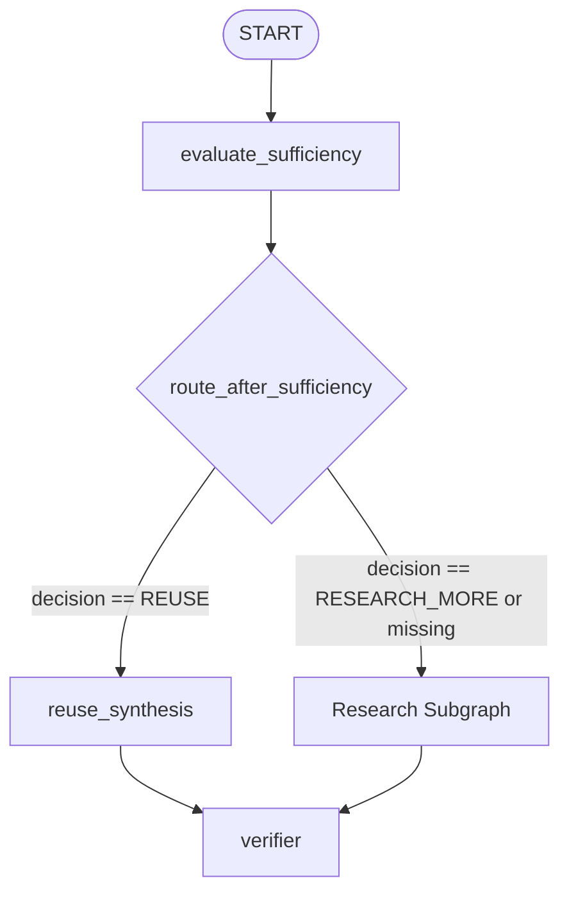
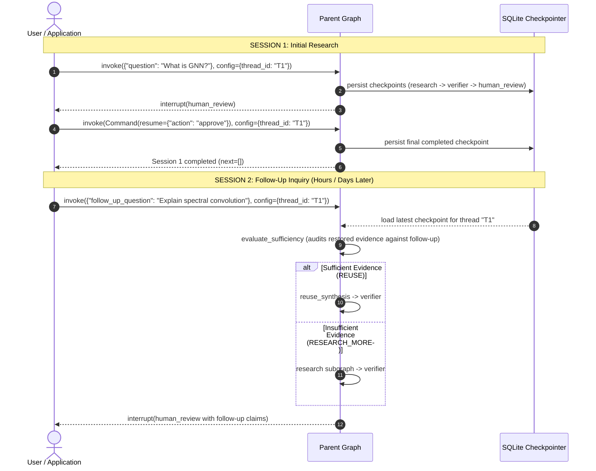
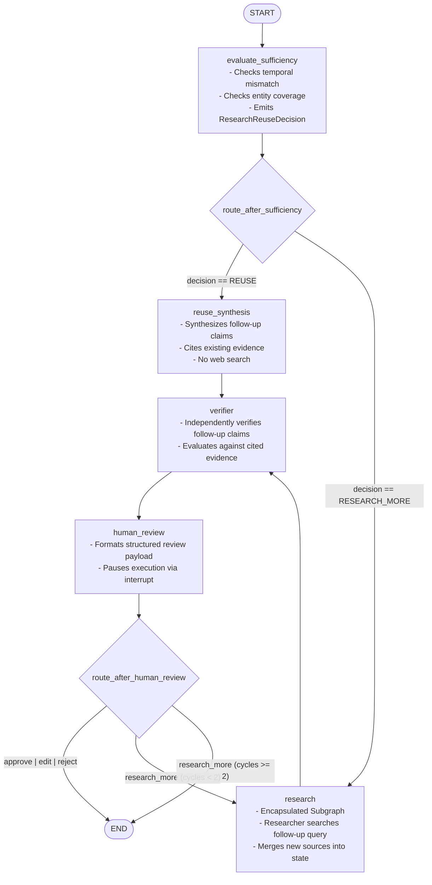

# Architecture Design: Follow-Up Research Sessions

This document details the architectural rationale, design decisions, state boundaries, evaluation criteria, execution flow, verification mechanics, and failure modes for **Follow-Up Research Sessions** in the **Verified Research Agent**.

---

## 1. Conversational Memory vs. Research-Session Continuity

A critical architectural distinction governs this system:

| Dimension | Conversational Memory (Chatbots) | Research-Session Continuity (This System) |
| :--- | :--- | :--- |
| **Primary Abstraction** | Message history (`list[BaseMessage]`) | Structured state: Evidence, Claims, Verifications, Sources |
| **Objective** | Conversational coherence & dialogue flow | Fact-grounded query answering with verifiable provenance |
| **Token Utilization** | Re-sends conversation turns, causing context explosion | Reuses grounded evidence excerpts without unbounded chat bloat |
| **Hallucination Risk** | High (LLM recalls prior chat without citation anchors) | Low (all propositions strictly tied to immutable source excerpts) |
| **Decision Mechanism** | Implicit next-token generation | Explicit, typed sufficiency audit (`ResearchReuseDecision`) |

This system is deliberately **not** a chat memory system. It does not store conversational banter or raw chat logs. Instead, it provides **research-session continuity**: the ability to receive a follow-up inquiry on an existing research thread, evaluate whether previously retrieved and verified evidence already answers the new query, and either synthesize new claims from existing evidence or expand research via targeted queries.

---

## 2. Why Evidence is Reused Instead of Re-searching

Re-searching the web for every follow-up question introduces three severe anti-patterns in production research agents:
1. **Redundant Latency and API Costs**: Web search API calls and initial parsing take seconds and incur monetary costs. If prior research on "Graph Convolutional Networks" already retrieved authoritative papers explaining layer-wise propagation, re-querying the web is wasteful.
2. **Context Fragmentation & Noise**: Multiple consecutive web searches on overlapping topics clutter state with redundant, low-quality, or contradictory source pages.
3. **Loss of Coherence**: Re-searching causes the agent to forget or discard high-quality primary sources already assembled in the thread.

By evaluating research sufficiency first, the system leverages previously retrieved sources and extracted evidence excerpts whenever they substantively cover the follow-up query scope.

---

## 3. How Temporal and Entity Mismatch are Evaluated

The `evaluate_sufficiency` node audits the relationship between the follow-up question and the accumulated research state using deterministic heuristics or structured LLM auditing.

### A. Temporal Scope Mismatch Check
- **Problem**: Evidence gathered for a baseline question often contains time-bounded facts (e.g., literature published in 2024). If the follow-up asks: *"What are the 2026 breakthroughs in this field?"*, existing evidence cannot answer the question without hallucination.
- **Evaluation**: The evaluator extracts 4-digit years from the query. If a requested year does not exist in any evidence excerpt or source text in state, a temporal mismatch is flagged immediately:
  ```python
  decision = "RESEARCH_MORE"
  reasoning = "Follow-up requests information from year '2026', absent from existing evidence."
  missing_topics = ["Temporal coverage for year 2026"]
  ```

### B. Entity / Topic Mismatch Check
- **Problem**: A follow-up submitted on a thread might introduce completely unrelated entities or subject domains (e.g., asking about CRISPR Cas9 on a thread that researched Graph Neural Networks).
- **Evaluation**: Substantive query terms (non-stopwords) are checked against the textual corpus of state (sources, evidence, findings, claims). If keyword/entity coverage falls below 35%, an entity mismatch is flagged:
  ```python
  decision = "RESEARCH_MORE"
  reasoning = "Follow-up introduces topics or entities not covered in existing research."
  missing_topics = ["crispr", "cas9", "guide"]
  ```

### C. Scope Sufficiency Check
- If temporal constraints match and entity coverage is high, the query is confirmed as answerable from existing research:
  ```python
  decision = "REUSE"
  reasoning = "Existing findings and evidence excerpts comprehensively address the follow-up question."
  missing_topics = []
  ```

---

## 4. Router Decision Logic

The sufficiency router (`route_after_sufficiency`) operates deterministically based on the state's `reuse_decision`:



### Deterministic Routing Rules
1. **Initial Run**: If no prior sources or evidence exist in state, `evaluate_sufficiency` emits `RESEARCH_MORE`. Router selects `"research"`.
2. **Follow-Up with Sufficient Evidence**: If `reuse_decision.decision == "REUSE"`, router selects `"reuse_synthesis"`. Web search is bypassed entirely.
3. **Follow-Up with Insufficient Evidence**: If `reuse_decision.decision == "RESEARCH_MORE"`, router selects `"research"`. The research subgraph re-enters with the follow-up objective.
4. **Fallback Default**: Any missing or corrupted decision defaults safely to `"research"`.

---

## 5. Why Follow-Up Claims Must be Independently Verified

A critical safety principle in verified research pipelines:

> **Old evidence does NOT imply new claims are true.**

Consider this scenario:
- **Session 1**: Evidence `ev_001` states: *"Model X achieved 85% accuracy on dataset Y in 2024."* Claim A (*"Model X achieved 85% on Y"*) was verified as `SUPPORTED`.
- **Session 2 (Follow-up)**: The reuse analyst synthesizes Claim B: *"Model X outperforms all competing architectures on benchmark Y."*

Even though Claim B cites `ev_001`, `ev_001` only mentions Model X's accuracy—it does not substantiate superiority over all competitors! If the system assumed that reusing `ev_001` automatically verified Claim B, an unfounded claim would pass unchecked.

Therefore:
- **Every follow-up claim is independently evaluated** by the `ClaimVerifierService`.
- Old verification verdicts are never inherited by new claims.
- The verifier generates fresh `VerificationResult` records for all follow-up claims before pausing for human review.

---

## 6. Evidence Traceability Across Sessions

Referential integrity (`validate_traceability`) is strictly maintained across session boundaries:

```
[ Claim B (Session 2) ]
          │ (references evidence_ids=['ev_001'])
          ▼
[ Evidence ev_001 (Session 1) ]
          │ (references source_id='src_001')
          ▼
[ Source src_001 (Session 1) ]
```

### Traceability Rules
1. **Stable Identifiers**: Sources and Evidence created in earlier sessions retain their IDs (`src_001`, `ev_001`) in durable storage.
2. **Cross-Session Citation**: Follow-up claims may reference evidence gathered in any previous session on the thread.
3. **Strict Validation**: Before claims reach the verifier or human reviewer, `validate_traceability` asserts:
   - Every `claim.evidence_ids` exists in `state["evidence"]`.
   - Every `evidence.source_id` exists in `state["sources"]`.
   - No orphaned or invented identifiers exist.

---

## 7. How Checkpoints Support Session Continuity

Persistence across follow-up sessions relies on LangGraph checkpointer architecture (`SqliteSaver` / `MemorySaver`):



1. **Session 1 Completion**: Graph execution reaches `END`. The final state contains `sources`, `evidence`, `findings`, and `claims`.
2. **Follow-Up Invocation**: Invoking `graph.invoke({"follow_up_question": ...}, config={"configurable": {"thread_id": "T1"}})` automatically loads the persisted state from SQLite.
3. **Thread Continuity**: Because the same `thread_id` is supplied, the agent resumes with the complete historical evidence and source repository intact.

---

## 8. State Boundaries: Session Context vs. Research State

The `ResearchState` schema strictly separates session context from internal research state:

```python
class ResearchState(TypedDict):
    # --------------------------------------------------------------------------
    # 1. Conversation & Session Context (Cross-Session Boundary)
    # --------------------------------------------------------------------------
    question: str
    follow_up_question: NotRequired[str | None]
    previous_questions: NotRequired[list[str]]
    reuse_decision: NotRequired[ResearchReuseDecision]

    # --------------------------------------------------------------------------
    # 2. Research Subgraph State (Internal Execution State)
    # --------------------------------------------------------------------------
    sources: NotRequired[list[Source]]
    findings: NotRequired[list[Finding]]
    critique: NotRequired[Critique]
    research_iteration: NotRequired[int]

    # --------------------------------------------------------------------------
    # 3. Evidence & Verification State (Durable Knowledge Artifacts)
    # --------------------------------------------------------------------------
    evidence: NotRequired[list[Evidence]]
    claims: NotRequired[list[Claim]]
    verification_results: NotRequired[list[VerificationResult]]

    # --------------------------------------------------------------------------
    # 4. Parent / Human-in-the-Loop Orchestration State
    # --------------------------------------------------------------------------
    human_review: NotRequired[HumanReview]
    human_research_cycles: NotRequired[int]
    human_feedback: NotRequired[str | None]
    max_human_cycles_reached: NotRequired[bool]
```

### Why This Boundary Exists
- **Session Context** (`question`, `follow_up_question`, `previous_questions`, `reuse_decision`): Tracks user interaction and query history across turns. It lives at the parent level.
- **Research Subgraph State** (`sources`, `findings`, `critique`, `research_iteration`): Transient worker state inside the research-critic cycle. Iteration counters reset when a new research pass begins.
- **Evidence & Verification State**: Immutable ground truth. Evidence items are never deleted; new evidence is merged or appended. Claims and verification results reflect the current substantive answer.

---

## 9. Complete Parent Graph Architecture Diagram



---

## 10. Failure Modes and Mitigations

| Failure Mode | Root Cause | Architectural Mitigation |
| :--- | :--- | :--- |
| **False-Positive Reuse** (Hallucination) | Sufficiency evaluator assumes old evidence covers new temporal facts. | Deterministic temporal regex extracts years (e.g. 2026). If year is missing from evidence, forces `RESEARCH_MORE`. |
| **False-Negative Reuse** (Redundant Search) | Evaluator fails to recognize synonymous phrasing of prior findings. | Entity and keyword coverage check compares substantive nouns. LLM sufficiency fallback parses semantic equivalence. |
| **Unverified Reused Claims** | Trusting that because evidence was verified in session 1, new claims are valid. | Mandatory pass through `verifier` node. Claims receive independent verdicts regardless of evidence origin. |
| **Source / Evidence ID Collisions** | Session 2 generates `src_001` or `ev_001` conflicting with Session 1. | Incremental ID generation (`len(existing) + 1`) ensures strictly unique identifiers across accumulated state. |
| **Infinite Subgraph Cycles** | Follow-up research queries trigger endless critic loops. | Subgraph enforces `DEFAULT_MAX_ITERATIONS = 3`. Parent resets `research_iteration = 0` on entry to guarantee bounded execution. |
| **Unbounded HITL Loops** | Human reviewer repeatedly requests `research_more`. | Parent graph enforces `DEFAULT_MAX_HUMAN_RESEARCH_CYCLES = 2`. Exceeding cap routes deterministically to `END`. |
| **Deserialization Failure on Resume** | Pydantic model `ResearchReuseDecision` rejected by SQLite unpickler. | Pre-registered in `CHECKPOINT_ALLOWED_TYPES` allowlist in `src/verified_research/persistence/sqlite.py`. |
