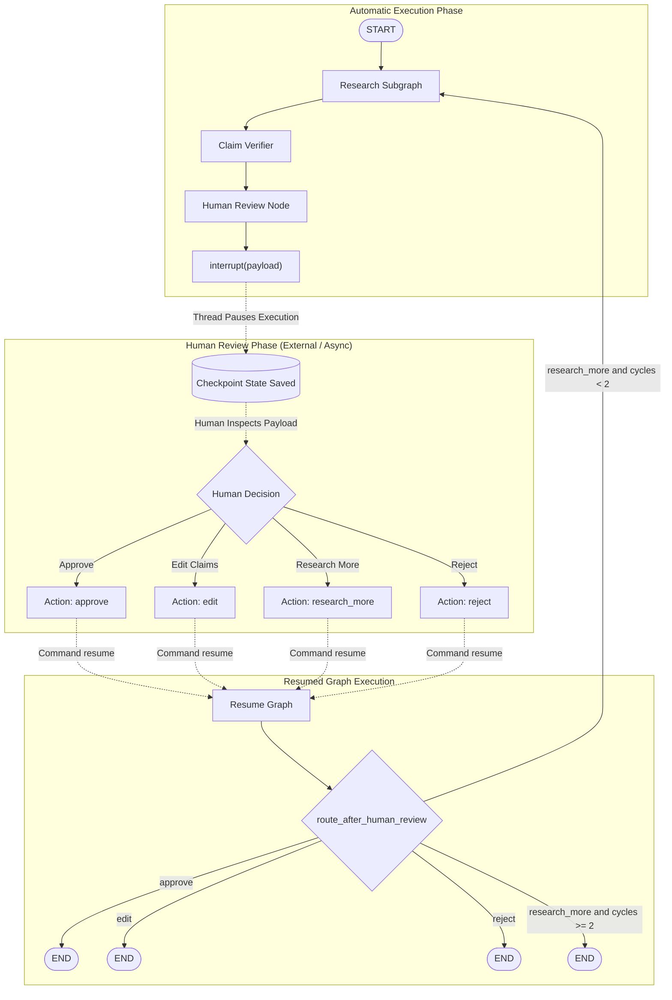

# Architecture Design: Human-in-the-Loop (HITL) Review

This document details the architectural rationale, design decisions, execution flow, validation guarantees, cycle bounds, and state contracts for the **Human-in-the-Loop (HITL)** subsystem in the **Verified Research Agent**.

---

## 1. Why Human-in-the-Loop is Needed

Autonomous AI research agents generate hypotheses, retrieve web sources, synthesize findings, extract atomic claims, and verify evidentiary grounding. However, fully autonomous loops without human supervision exhibit several critical failure modes:

1. **Strategic Intent Misalignment**: An agent may faithfully answer a literal query while diverging from the user's substantive analytical goal.
2. **Acceptable Risk Thresholds**: Automated claim verification categorizes claims as `SUPPORTED`, `PARTIAL`, or `UNSUPPORTED`. Determining whether a report with partial claims is publication-ready requires human domain judgment.
3. **Domain Nuance and Expert Intervention**: In regulated, scientific, or high-stakes environments, automated systems cannot unilaterally publish or finalize findings without expert audit and potential text adjustments.
4. **Targeted Steering**: When evidence is incomplete, a human domain expert can direct follow-up queries far more effectively than automated heuristic retries.

HITL establishes a formal bridge between autonomous state transitions and human judgment without requiring polling, interactive CLI input blocking, or ad-hoc process interruptions.

---

## 2. Why a Boolean Approval Field is Insufficient

A common anti-pattern in naive HITL designs is reducing human interaction to a binary approval flag:
```python
# Naive anti-pattern:
class NaiveState(TypedDict):
    is_approved: bool  # Insufficient for production workflows
```

A Boolean field fails for multiple architectural reasons:

1. **Information Asymmetry**: A Boolean cannot capture *why* research was rejected or *what* specific gaps need additional investigation.
2. **All-or-Nothing Rigidity**: If a human wants to accept 9 out of 10 claims but tweak the phrasing of one, a Boolean forces a binary choice: accept errors or discard the entire research output.
3. **No Direct Correction Path**: A Boolean cannot carry edited claims, forcing humans to re-run expensive end-to-end research pipelines for minor phrasing adjustments.
4. **State Machine Ambiguity**: `is_approved=False` does not distinguish between *"reject and terminate"* versus *"reject and research more"*.
5. **Loss of Auditability**: Compliance and provenance frameworks require immutable records of human actions, timestamps, rationale, and specific diffs.

---

## 3. Human Actions: Taxonomy and Schema

To provide expressive, audit-grade human control, the system defines four mutually exclusive, deterministic actions via `HumanReview`:

```python
HumanActionType = Literal["approve", "edit", "research_more", "reject"]


class HumanReview(BaseModel):
    model_config = ConfigDict(frozen=True, extra="forbid")

    action: HumanActionType = Field(
        ...,
        description="Review action: approve, edit, research_more, or reject.",
    )
    feedback: str | None = Field(
        default=None,
        description="Optional human guidance or feedback for research cycles.",
    )
    edited_claims: list[Claim] | None = Field(
        default=None,
        description="List of edited Claim objects required when action is 'edit'.",
    )
```

### Action Semantics

| Action | Intent | Required Fields | Next Routing | Final Output |
| :--- | :--- | :--- | :--- | :--- |
| **`approve`** | Research and verification meet quality standards. | None | `END` | Approved claims and verification results. |
| **`edit`** | Findings are mostly valid, but specific claims require wording corrections or scope narrowing. | `edited_claims` (non-empty `list[Claim]`) | `END` | Updated `claims` list in state, approved as edited. |
| **`research_more`** | Findings have identifiable coverage gaps requiring follow-up discovery. | `feedback` (optional string) | `research` (if under cycle limit) else `END` | Initiates targeted research pass incorporating human feedback. |
| **`reject`** | Research is fundamentally flawed, off-topic, or unrecoverable. | `feedback` (optional string) | `END` | Terminal rejection state without downstream generation. |

---

## 4. Execution Flow: Automatic to Interrupt to Human to Resume

The execution lifecycle transitions from fully automated computation to an execution pause (`interrupt()`), awaiting asynchronous human response, followed by a deterministic resume (`Command(resume=...)`):



---

## 5. LangGraph `interrupt()` Mechanism

Rather than blocking a Python thread with `input()` or running busy-wait polling loops, the architecture uses LangGraph's native pause primitive:

```python
from langgraph.types import interrupt

def human_review_node(state: ResearchState) -> dict[str, Any]:
    payload = build_review_payload(state)
    raw_decision = interrupt(payload)
    ...
```

### Key Properties of `interrupt()`
1. **Non-blocking**: Execution yields immediately; thread workers and server processes are freed.
2. **State Serialization**: The thread state prior to node execution is preserved in the checkpointer.
3. **Payload Passing**: The argument passed to `interrupt(payload)` is made accessible via `graph.get_state(config).tasks[0].interrupts[0].value`.
4. **Resume Delivery**: When resumed via `Command(resume=...)`, `interrupt()` returns the resume value directly inside the node execution frame.

---

## 6. The Human Review Payload

Before yielding control, `build_review_payload(state)` constructs a comprehensive, self-contained, JSON-serializable representation of the findings:

```json
{
  "type": "human_review",
  "question": "What is the inference latency of GNNs compared to Transformers?",
  "claims": [
    {
      "claim_id": "claim_001",
      "text": "GNN latency averages 12ms per batch in benchmarking.",
      "evidence_ids": ["ev_001"]
    }
  ],
  "evidence": [
    {
      "evidence_id": "ev_001",
      "source_id": "src_001",
      "text": "Benchmarking reveals GNN batch inference executes at 12ms."
    }
  ],
  "verification_results": [
    {
      "claim_id": "claim_001",
      "verdict": "SUPPORTED",
      "confidence": 0.98,
      "reasoning": "Evidence explicitly confirms 12ms inference latency."
    }
  ],
  "review_items": [
    {
      "claim_id": "claim_001",
      "text": "GNN latency averages 12ms per batch in benchmarking.",
      "evidence": [
        {
          "evidence_id": "ev_001",
          "source_id": "src_001",
          "text": "Benchmarking reveals GNN batch inference executes at 12ms.",
          "source_title": "Benchmark Report",
          "source_url": "https://example.com/bench"
        }
      ],
      "verification": {
        "verdict": "SUPPORTED",
        "confidence": 0.98,
        "reasoning": "Evidence explicitly confirms 12ms inference latency."
      }
    }
  ],
  "human_research_cycles": 0
}
```

### Safety and Cleanliness Guarantees
- **No Secrets**: Contains zero API keys, environment credentials, or database connection strings.
- **Full Traceability**: Maps claims directly to supporting evidence snapshots and parent source URLs.
- **Verification Grounding**: Human reviewers see the verifier's exact verdict, confidence, and chain-of-thought rationale.

---

## 7. Supported Resume Mechanism

To resume an interrupted graph execution, the host application invokes the compiled graph with a `Command(resume=...)` object targeted to the same thread configuration:

```python
from langgraph.types import Command

config = {"configurable": {"thread_id": "session-123"}}

# Initial invocation halts at human review:
output = graph.invoke({"question": "What is the inference latency of GNNs?"}, config)

# Human decision supplied asynchronously:
human_input = {
    "action": "research_more",
    "feedback": "Retrieve comparisons with FP16 precision."
}

# Resume graph execution:
resumed_output = graph.invoke(Command(resume=human_input), config)
```

The resumed value is returned inside `human_review_node`, validated against `HumanReview`, processed into state updates, and evaluated by `route_after_human_review`.

---

## 8. State Ownership Boundary

To maintain separation of concerns and avoid leaky abstractions, graph state is strictly partitioned:

```
┌────────────────────────────────────────────────────────────────────────┐
│                        RESEARCH STATE SCHEMA                           │
├────────────────────────────────────────────────────────────────────────┤
│  1. RESEARCH SUBGRAPH INTERNAL STATE                                   │
│     • question: str                                                    │
│     • sources: list[Source]                                            │
│     • findings: list[Finding]                                          │
│     • critique: Critique                                               │
│     • research_iteration: int (Internal cycle: Researcher/Analyst)     │
├────────────────────────────────────────────────────────────────────────┤
│  2. EVIDENCE & VERIFICATION STATE                                      │
│     • evidence: list[Evidence]                                         │
│     • claims: list[Claim]                                              │
│     • verification_results: list[VerificationResult]                   │
├────────────────────────────────────────────────────────────────────────┤
│  3. PARENT / HITL ORCHESTRATION STATE                                  │
│     • human_review: HumanReview                                        │
│     • human_research_cycles: int (Human review re-entry counter)       │
│     • human_feedback: str | None (Steering prompt for next cycle)     │
│     • max_human_cycles_reached: bool                                   │
└────────────────────────────────────────────────────────────────────────┘
```

The parent graph owns HITL lifecycle fields. The internal research subgraph remains encapsulated and unaware of UI or review sessions, only consuming `human_feedback` when provided.

---

## 9. Difference Between `research_iteration` and `human_research_cycles`

It is vital to distinguish between the two distinct loop counters:

| Metric | `research_iteration` | `human_research_cycles` |
| :--- | :--- | :--- |
| **Scope** | Subgraph-internal | Parent graph orchestration |
| **Participants** | `Researcher` $\leftrightarrow$ `Analyst` $\leftrightarrow$ `Critic` | `Research Subgraph` $\leftrightarrow$ `Verifier` $\leftrightarrow$ `Human Review` |
| **Trigger** | Critic evaluation (`Critique.should_research_again`) | Human review decision (`HumanReview.action == 'research_more'`) |
| **Cutoff Limit** | `MAX_ITERATIONS = 3` | `MAX_HUMAN_RESEARCH_CYCLES = 2` |
| **Reset Behavior** | Reset to `0` at the start of each human cycle | Monotonically increments per human loop; never resets |

If `research_iteration` were reused across human cycles, a research subgraph that required 3 internal iterations in pass 1 would immediately fail with an iteration overflow when the human requested follow-up research. Resetting `research_iteration = 0` upon each human-triggered pass guarantees the subgraph can perform full iterative refinement.

---

## 10. Deterministic Routing After Human Review

Routing decisions are purely algorithmic and deterministic. No LLM call is made to choose the route:

```python
def route_after_human_review(
    state: ResearchState,
    max_human_research_cycles: int = DEFAULT_MAX_HUMAN_RESEARCH_CYCLES,
) -> Literal["research", "end"]:
    review = state.get("human_review")
    if review is None:
        return "end"

    if review.action in ("approve", "edit", "reject"):
        return "end"

    if review.action == "research_more":
        cycles = state.get("human_research_cycles", 0)
        if cycles < max_human_research_cycles:
            return "research"
        else:
            return "end"

    return "end"
```

---

## 11. Edit Action & Referential Validation

When the human selects `edit`, the system does not allow arbitrary or corrupted edits to enter state. Edits are subject to strict structural validation:

1. **Schema Validation**: Each claim in `edited_claims` is parsed as a Pydantic `Claim` model (verifying non-empty `claim_id`, `text`, and `evidence_ids`).
2. **Identifier Uniqueness**: No two claims in `edited_claims` may share the same `claim_id`.
3. **Referential Grounding**: Every ID in `claim.evidence_ids` must resolve to an existing `Evidence` snapshot in `state['evidence']`.
4. **Fail-Fast Error Handling**: If an edited claim cites an unknown evidence ID, an `UnknownEvidenceError` is raised immediately. The system **never** silently discards citations or invents dummy evidence.

---

## 12. Rejection Handling

When a human reviewer selects `reject`:
1. The decision is recorded in `state['human_review']` with `action="reject"` and optional `feedback`.
2. `route_after_human_review` routes directly to `END`.
3. Downstream synthesis (e.g. final report generation in future phases) is bypassed.
4. The pipeline concludes with a clear audit record of rejection rather than presenting unapproved claims as verified.

---

## 13. Termination Guarantees

Infinite loops in HITL workflows are mathematically impossible due to dual hard bounds:

1. **Internal Subgraph Bound**: `research_iteration < MAX_ITERATIONS (3)` guarantees the researcher-critic loop always terminates.
2. **Human Research Cycle Bound**: `human_research_cycles < MAX_HUMAN_RESEARCH_CYCLES (2)` guarantees that even if a human continuously requests `research_more`, the parent graph re-enters research at most 2 times before forcing termination at `END`.
3. **Deterministic Leaf Actions**: `approve`, `edit`, and `reject` immediately route to `END`.

$$\text{Total Subgraph Invocations} \le 1 + \text{MAX\_HUMAN\_RESEARCH\_CYCLES} = 3$$

---

## 14. Why Checkpointing Becomes Essential

In earlier phases, execution was synchronous and in-memory. In Phase 7:
1. `interrupt()` requires a state persistence backend to save intermediate graph states while waiting for human input.
2. Resuming via `Command(resume=...)` requires loading the exact state snapshot corresponding to `thread_id`.
3. For local unit testing and development, `MemorySaver` provides ephemeral in-memory checkpointing.

---

## 15. Why Full Persistence is Deferred to Phase 8

While `MemorySaver` satisfies in-process testing and development, full production persistence is intentionally deferred to Phase 8:

- **Process Lifetime**: `MemorySaver` lives in RAM. Restarting the server drops all active threads.
- **Multi-Tenant Scaling**: Production deployments require durable distributed storage (such as SQLite or Postgres checkpointers).
- **Session Thread Management**: Thread cleanup, eviction policies, and connection pooling belong to the persistence layer.
- **Separation of Architectural Concerns**: Keeping Phase 7 focused on HITL graph flow, interrupts, resumes, and edit validation ensures the core state machine logic is decoupled from database drivers.
