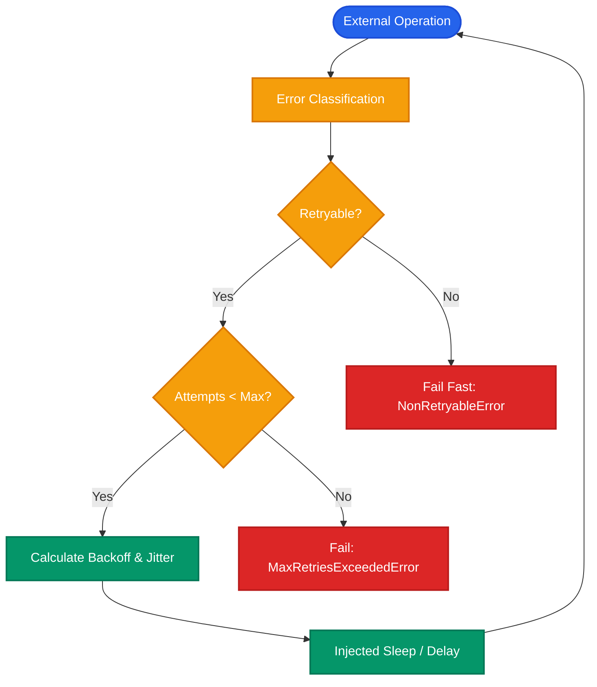

# Architecture Design: Reliability Engineering

This document details the architectural rationale, design decisions, failure models, error classification, retry policies, backoff mechanics, idempotency constraints, and persistence compatibility for the **Reliability Engineering Layer** in the **Verified Research Agent**.

---

## 1. Failure Model: What Can Fail in the System

In a complex multi-agent verified research system, external operations interact with remote services and non-deterministic neural models. Failures occur across four primary failure boundaries:



### Primary Failure Boundaries
1. **Search API Operations (`TavilySearchClient`)**:
   - Network connectivity drops, socket timeouts, DNS resolution failures.
   - Provider HTTP 5xx errors (500 Internal Server Error, 502 Bad Gateway, 503 Service Unavailable, 504 Gateway Timeout).
   - Provider rate limits (HTTP 429 Too Many Requests).
   - Authentication errors (missing or invalid `TAVILY_API_KEY`, HTTP 401/403).
   - Malformed queries (empty or illegal query strings, HTTP 400).
2. **LLM Provider Operations (`ChatGroq` / `OpenAI`)**:
   - Transient cloud outages, gateway timeouts (502, 503, 504).
   - Rate limits (TPM/RPM token quotas exceeded, HTTP 429).
   - Authentication failures (missing or invalid `GROQ_API_KEY`, HTTP 401/403).
   - Context window limit exceeded (HTTP 400 / BadRequestError).
3. **Structured Output Decoding & Schema Validation**:
   - Model generates truncated JSON or syntactically invalid output.
   - Model hallucinates extra fields when `extra="forbid"` is enforced.
   - Model produces illegal enum variants (e.g., verifier emitting `"MAYBE"` instead of `"SUPPORTED"`, `"PARTIAL"`, `"UNSUPPORTED"`).
4. **Internal State Transitions**:
   - Graph state contract violations (e.g., missing mandatory keys, unrecognized worker names).

---

## 2. Retryable vs. Non-Retryable Failures

The reliability layer enforces a strict distinction between **transient operational faults** and **permanent architectural / configuration errors**:

| Error Category | Typical Trigger | Classification | Rationale & Action |
| :--- | :--- | :--- | :--- |
| **`NETWORK_TIMEOUT`** | Socket timeout, HTTP 408, connection dropped after 30s | **Retryable** | Network congestion or peer lag is often transient; retry with exponential backoff. |
| **`RATE_LIMIT`** | HTTP 429 Too Many Requests, Groq TPM/RPM limit | **Retryable** | Rate limit tokens refill over time; backoff provides recovery window. |
| **`SERVER_ERROR`** | HTTP 500, 502, 503, 504, ConnectionResetError | **Retryable** | Remote server or load balancer transient hiccup; retry. |
| **`MALFORMED_OUTPUT`**| Pydantic `ValidationError`, `JSONDecodeError` | **Retryable (Bounded)** | Neural generation sampling may produce invalid JSON; retry up to `max_attempts` without altering prompts or inventing data. |
| **`AUTH_ERROR`** | HTTP 401 Unauthorized, 403 Forbidden, `MissingApiKeyError` | **Non-Retryable** | Credentials cannot fix themselves by retrying; fail fast immediately. |
| **`CLIENT_ERROR`** | HTTP 400 Bad Request, 404 Not Found, 422 Unprocessable | **Non-Retryable** | The request was malformed or resource does not exist; retrying will produce the same error. |
| **`CONFIGURATION_ERROR`**| `ValueError`, unsupported model provider | **Non-Retryable** | System misconfiguration requires developer/environment fix; fail fast. |
| **`UNKNOWN`** | Unrecognized generic Python exceptions | **Non-Retryable** | Safe default preventing unbounded execution on unexpected error modes. |

---

## 3. Centralized Retry Policy

The system avoids scattering ad-hoc `for` loops across agent nodes by providing a centralized [`RetryPolicy`](file:///d:/research-agent/src/verified_research/reliability/policy.py):

```python
class RetryPolicy:
    def __init__(
        self,
        max_attempts: int = DEFAULT_RETRY_MAX_ATTEMPTS,       # 3
        base_delay: float = DEFAULT_RETRY_BASE_DELAY,         # 1.0s
        max_delay: float = DEFAULT_RETRY_MAX_DELAY,           # 60.0s
        backoff_factor: float = DEFAULT_RETRY_BACKOFF_FACTOR, # 2.0
        jitter: bool = DEFAULT_RETRY_JITTER,                  # True
        jitter_factor: float = 0.5,
        sleep_fn: Callable[[float], None] | None = None,
        random_fn: Callable[[float, float], float] | None = None,
    ) -> None: ...
```

### Mathematical Formulation
For execution attempt $k \in \{1, 2, \dots, \text{max\_attempts}\}$:

$$\text{raw\_delay}(k) = \min\left(\text{max\_delay}, \text{base\_delay} \times \text{backoff\_factor}^{k - 1}\right)$$

When jitter is enabled ($\text{jitter} = \text{True}$):
$$\text{delay}(k) \sim \mathcal{U}\left(\max(0, \text{raw\_delay} \times (1 - \text{jitter\_factor})), \min(\text{max\_delay}, \text{raw\_delay} \times (1 + \text{jitter\_factor}))\right)$$

### Default Parameters
- `max_attempts = 3`: Guarantees bounded execution (no runaway loops).
- `base_delay = 1.0`: Initial retry starts after 1.0 second.
- `backoff_factor = 2.0`: Consecutive delays scale exponentially ($1.0\text{s} \to 2.0\text{s} \to 4.0\text{s} \dots$).
- `max_delay = 60.0`: Hard ceiling preventing astronomical sleep durations.
- `jitter = True`: De-synchronizes thundering-herd concurrent retries.

---

## 4. Search API Reliability

Applied directly to [`TavilySearchClient.search`](file:///d:/research-agent/src/verified_research/tools/search.py):

1. **Authentication Check**: If `api_key` is missing or empty, raises [`MissingApiKeyError`](file:///d:/research-agent/src/verified_research/tools/search.py#L19) immediately before any network call.
2. **Empty Query Guard**: If query is whitespace, returns empty list `[]` without network overhead.
3. **Execution with Retry**: Wraps Tavily API call with `execute_with_retry`.
4. **Error Wrapping & Provenance**: If retries are exhausted or a non-retryable error occurs, catches the exception and raises [`SearchError`](file:///d:/research-agent/src/verified_research/tools/search.py#L12) with the serializable [`ErrorInfo`](file:///d:/research-agent/src/verified_research/reliability/models.py#L21) attached.

---

## 5. LLM Reliability & Structured Output Preservation

Applied across [`analyst_node`](file:///d:/research-agent/src/verified_research/agents/analyst.py#L66), [`ClaimVerifierService`](file:///d:/research-agent/src/verified_research/agents/verifier.py#L24), and [`critic_node`](file:///d:/research-agent/src/verified_research/agents/critic.py#L47):

1. **Transient Provider Faults**: Network timeouts and 429 rate limits are automatically caught and retried according to policy.
2. **Malformed Structured Output**:
   - If the model returns malformed JSON or violates Pydantic constraints, the exception is classified as `ErrorCategory.MALFORMED_OUTPUT`.
   - The operation undergoes bounded retry (up to `max_attempts`).
   - If retries exhaust, raises a clear error.
   - **Crucial Invariant**: The system **never silently repairs, fabricates, or invents factual findings**. Schema integrity is absolute. Domain enums like `SUPPORTED`, `PARTIAL`, `UNSUPPORTED` remain strictly typed.

---

## 6. Error Metadata & Secret Sanitization

Errors are converted into serializable, immutable data models:

```python
class ErrorInfo(BaseModel):
    model_config = ConfigDict(extra="forbid", frozen=True)

    component: str             # e.g., 'search', 'analyst', 'verifier'
    operation: str             # e.g., 'tavily_search', 'llm_synthesis'
    error_type: str            # e.g., 'TimeoutError', 'HTTPError'
    category: ErrorCategory    # e.g., 'network_timeout', 'rate_limit'
    message: str               # Sanitized message with redacted tokens
    retryable: bool            # Whether failure was retryable
    attempts: int              # Total attempts made
    status_code: int | None    # HTTP status code if present
    details: dict[str, str]    # Additional diagnostic metadata
```

### Zero Credential Leakage
All error strings pass through [`sanitize_error_message`](file:///d:/research-agent/src/verified_research/reliability/classification.py#L24) before being stored or logged:
- Tavily keys (`tvly-[a-zA-Z0-9_\-]{16,}`) $\to$ `[REDACTED_TAVILY_KEY]`
- Groq keys (`gsk_[a-zA-Z0-9_\-]{16,}`) $\to$ `[REDACTED_GROQ_KEY]`
- OpenAI keys (`sk-[a-zA-Z0-9_\-]{16,}`) $\to$ `[REDACTED_API_KEY]`
- Bearer tokens (`Bearer\s+[a-zA-Z0-9_\-\.]{16,}`) $\to$ `Bearer [REDACTED_TOKEN]`

---

## 7. Separation of Iteration and Retry Counters

A critical architectural discipline is maintaining total separation between operational retries and multi-agent graph iterations:

| Mechanism | Counter Name | State Location | Scope | Reset Policy | Purpose |
| :--- | :--- | :--- | :--- | :--- | :--- |
| **Operation Retry** | `attempts` | Local operation stack / `ErrorInfo.attempts` | Single API invocation | Discarded after call returns or fails | Overcomes transient network or server glitches. |
| **Research Loop** | `research_iteration` | `ResearchState["research_iteration"]` | Encapsulated Subgraph (`researcher` $\to$ `analyst` $\to$ `critic`) | Resets to 0 upon human review re-entry or follow-up | Refines research depth based on critic guidance. |
| **Supervisor Loop** | `supervisor_steps` | `ResearchState["supervisor_steps"]` | Parent Orchestrator Loop ($S \to W \to S \to W$) | Never resets within a thread turn | Bounds total worker transitions and prevents runaway agent cycles. |
| **HITL Review Cycle** | `human_research_cycles` | `ResearchState["human_research_cycles"]` | Human Review Re-entry ($H \to R \to V \to H$) | Persists across resume calls; resets on new session | Bounds human-requested additional research passes. |

---

## 8. Checkpoint Persistence Interaction: Checkpointing $\neq$ Idempotency

### The Fundamental Distinction
- **State Checkpointing**: Persists state snapshots at node boundaries (after a node completes execution and returns state updates).
- **Operational Idempotency**: Guarantees that executing the same operation multiple times produces the exact same outcome without unintended duplicate side effects.

### Concrete System Analysis
1. **Search Operations**: `TavilySearchClient.search` is semantically read-only (fetching external web pages). However, repeated executions consume search API quotas and incur financial cost.
2. **LLM Invocations**: Structured synthesis and verification are stateless model queries (read-only, configured with `temperature=0.0`).
3. **Crash Recovery Window**:
   - If an external call succeeds, but the process terminates *before* LangGraph commits the node output to SQLite, restarting the thread from the checkpoint will re-execute the node's external calls.
   - Therefore, checkpoint persistence guarantees **resumability**, but **not** zero-duplicate network calls.
4. **Clean Serialization Guarantee**:
   - `ErrorInfo`, `ErrorCategory`, and `OperationMetadata` are explicitly registered in `CHECKPOINT_ALLOWED_TYPES` in [`src/verified_research/persistence/sqlite.py`](file:///d:/research-agent/src/verified_research/persistence/sqlite.py#L25).
   - No raw exception objects, open sockets, HTTP client sessions, or callbacks are stored in graph state.

---

## 9. Deterministic Testing Methodology

To satisfy strict reliability testing requirements without flaky tests or slow CI runs:
1. **Dependency Injection**: `RetryPolicy` accepts an injected `sleep_fn` and `random_fn`.
2. **Zero-Latency Test Execution**: In automated test environments (`PYTEST_CURRENT_TEST`), default sleep delays are bypassed (`_default_sleep`), allowing exponential backoff sequences (1.0s, 2.0s, 4.0s) to be asserted instantaneously.
3. **Mocks and Deterministic Sequences**: All network failures (503, 429, timeouts, malformed JSON) are simulated with deterministic mock callables. No live Tavily or Groq calls are made during unit testing.

---

## 10. Known Limitations

While robust against transient single-node faults, the current implementation has specific boundaries:
- **No Cross-Node Circuit Breaker**: If the Tavily search service experiences a multi-hour global outage, the researcher node will attempt 3 retries each time it is visited, rather than tripping an agent-wide circuit breaker.
- **No Distributed Rate Limiting**: Token bucket rate-limiting is local to process memory, rather than shared across distributed workers via Redis.
- **Local SQLite Persistence**: Checkpointing relies on single-writer SQLite, suitable for embedded and desktop workflows rather than multi-tenant horizontal clusters.

---

## 11. Deferred Work

The following features are intentionally deferred to future roadmap phases:
- **LangSmith Observability**: Distributed tracing, latency telemetry, and evaluation metrics dashboards.
- **Production Evaluation**: Automated benchmarking against production claim verifier datasets.
- **User Interface**: Web-based review interfaces and interactive human-in-the-loop dashboards.
- **Distributed Queuing**: Redis, Celery, or Kafka distributed retry workers.
