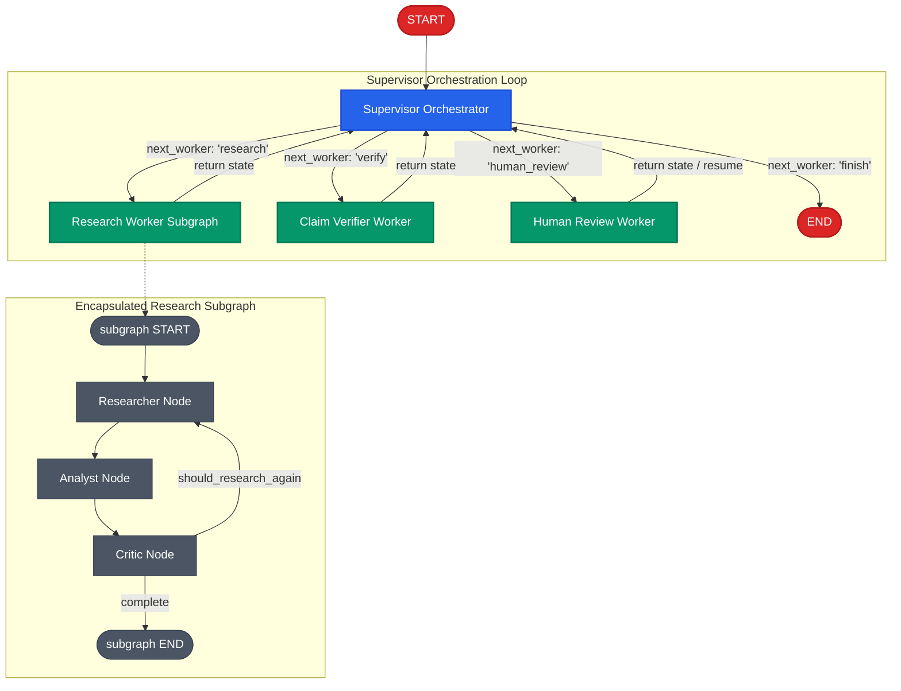

# Architecture Design: Supervisor Orchestration Layer

This document details the architectural rationale, design decisions, state schemas, specialized workers, invariant guards, policies, execution lifecycle, persistence compatibility, and tradeoffs for the **Supervisor Orchestration Layer** in the **Verified Research Agent**.

---

## 1. Executive Summary & Architectural Overview

The Supervisor Architecture introduces a central orchestration layer over specialized worker nodes. Rather than hardcoding a rigid sequential pipeline where nodes are wired linearly ($A \to B \to C \to D$), orchestration control is elevated to a dedicated **Supervisor** node.

### Core Architectural Principles
1. **Centralized Coordination, Specialized Execution**:
   - The Supervisor decides *which worker should run next* and *why*.
   - The Supervisor does **NOT** conduct web searches, synthesize findings, extract evidence, verify claims, or interact directly with human reviewers.
   - Workers specialize strictly in domain tasks and return control back to the Supervisor upon completion.
2. **Supervisor Loop Pattern**:
   - Execution strictly conforms to:
     $$\text{START} \longrightarrow \text{supervisor} \rightleftarrows \text{worker} \longrightarrow \text{supervisor} \longrightarrow \text{END}$$
   - Every worker transitions back to `supervisor`. No worker unilaterally routes to another worker or terminates execution directly.
3. **Strict Invariant Guards Over Machine Learning**:
   - Whether decisions are generated by a deterministic rule engine or an LLM, all decisions pass through an immutable **Invariant Guard** (`validate_supervisor_decision`).
   - Quality-critical constraints (e.g., claims cannot bypass verification; ungrounded verification is forbidden; human decisions are final) cannot be violated by model hallucinations or edge-case transitions.
4. **Three Independent Step Counters**:
   - `supervisor_steps`: Bounds supervisor loop iterations (default: 8).
   - `research_iteration`: Bounds internal subgraph loops between researcher, analyst, and critic (default: 3).
   - `human_research_cycles`: Bounds human-requested re-research passes (default: 2).

---

## 2. Architectural Diagram



---

## 3. Specialized Workers & Capabilities

The system isolates specialized domain logic into four dedicated workers:

| Worker Name | Implementation | Primary Responsibility | Input State Requirements | Output Updates |
| :--- | :--- | :--- | :--- | :--- |
| **`research`** | Encapsulated `ResearchSubGraph` (`researcher` $\to$ `analyst` $\to$ `critic`) | Executes multi-query search, source normalization, evidence extraction, finding synthesis, and critique evaluation. | `question`, `sources` (optional), `human_feedback` (optional) | `sources`, `evidence`, `findings`, `claims`, `critique`, `research_iteration` |
| **`verify`** | `verifier_node` (`VerifierService`) | Independently evaluates testable factual claims against atomic evidence excerpts with citation grounding. | `claims`, `evidence` | `verification_results` |
| **`human_review`** | `human_review_node` (`interrupt`) | Renders structured review payload and interrupts execution for human inspection (`approve`, `edit`, `research_more`, `reject`). | `claims`, `evidence`, `verification_results` | `human_review`, `claims` (if edited), `human_feedback` (if research_more) |
| **`finish`** | Terminal router mapping (`"finish": END`) | Safely terminates graph execution when objectives are fulfilled or bounds are reached. | `supervisor_decision` | Graph terminates at `END` |

### Worker Encapsulation Guarantee
No worker knows about the other workers. The `research` worker does not know a `verifier` exists; the `verifier` worker does not know how `evidence` was collected; the `human_review` worker does not decide whether to call the verifier or researcher next. All coordination is mediated through the Supervisor.

---

## 4. Supervisor Decision Schema

The supervisor outputs a strictly validated Pydantic model:

```python
SupervisorWorkerType = Literal["research", "verify", "human_review", "finish"]

class SupervisorDecision(BaseModel):
    """Structured decision produced by the Supervisor orchestrator."""

    model_config = ConfigDict(extra="forbid", frozen=True)

    next_worker: SupervisorWorkerType = Field(
        ...,
        description="The specialized worker selected for next execution: 'research', 'verify', 'human_review', or 'finish'.",
    )
    reasoning: str = Field(
        ...,
        min_length=1,
        description="Explicit architectural rationale explaining why this worker was chosen based on state audit.",
    )
```

### Schema Guarantees
- **Strict Worker Whitelist**: Only `"research"`, `"verify"`, `"human_review"`, and `"finish"` are valid. Arbitrary worker names (e.g., `"search_web"`, `"analyst"`, `"writer"`) are rejected immediately with a Pydantic `ValidationError`.
- **Immutable & Extra Forbidden**: `frozen=True` and `extra="forbid"` guarantee structural purity and prevent arbitrary state pollution.
- **Mandatory Non-Empty Rationale**: Every routing transition requires an audit trail string explaining the decision.

---

## 5. Supervisor Policies

The architecture supports pluggable decision policies via the `SupervisorPolicy` protocol:

```python
class SupervisorPolicy(Protocol):
    def evaluate(self, state: ResearchState) -> SupervisorDecision: ...
```

### A. DeterministicSupervisorPolicy
A deterministic, rules-based decision engine that guarantees predictable, quality-first progression:
1. **Step Bound Check**: If `supervisor_steps >= max_steps` $\to$ `finish`.
2. **Human Review Action Audit**:
   - `approve`, `edit`, `reject` $\to$ `finish`.
   - `research_more` $\to$ `research` (if `cycles < max_human_cycles`) else `finish`.
3. **Follow-Up Query Audit**:
   - If `reuse_decision == "REUSE"` and unverified claims exist $\to$ `verify`.
   - If `reuse_decision == "REUSE"` and all claims verified $\to$ `human_review`.
   - If `reuse_decision == "RESEARCH_MORE"` and iteration is 0 $\to$ `research`.
4. **Standard Quality Pipeline Progression**:
   - Missing sources, findings, or claims $\to$ `research`.
   - Unverified claims exist $\to$ `verify`.
   - All claims verified, awaiting review $\to$ `human_review`.

### B. LLMSupervisorPolicy
An LLM-driven decision engine using LangChain `with_structured_output(SupervisorDecision)`:
- System instruction describes the research objective, available workers, and quality requirements.
- Formats active question, follow-up query, source counts, claim counts, verification counts, and human review status.
- Invokes model with structured output.
- **Fail-Safe Fallback**: If the LLM call fails, times out, or produces unparseable output, the system seamlessly falls back to `DeterministicSupervisorPolicy`.
- **Invariant Guard Filtering**: The output of the LLM is passed through `validate_supervisor_decision`. If the LLM attempts an illegal transition (e.g., skipping verification), the guard automatically overrides the decision to maintain architectural integrity.

---

## 6. Architectural Invariant Guards

The supervisor is an orchestration layer, **not** an unconstrained source of truth. The `validate_supervisor_decision` function guarantees five system invariants:

```python
def validate_supervisor_decision(
    state: ResearchState,
    decision: SupervisorDecision,
    max_steps: int = DEFAULT_MAX_SUPERVISOR_STEPS,
    max_human_cycles: int = DEFAULT_MAX_HUMAN_RESEARCH_CYCLES,
) -> SupervisorDecision:
```

### The 5 System Invariants
1. **Step Limit Invariant**:
   - *Rule*: If `supervisor_steps >= max_steps`, the decision MUST be `finish`.
   - *Rationale*: Strictly prevents infinite graph oscillation or runaway execution loops.
2. **Verification Guard Invariant**:
   - *Rule*: Claims cannot bypass verification to reach `human_review` or `finish`. If unverified claims exist, candidate `human_review` or `finish` decisions are overridden to `verify`.
   - *Rationale*: Guarantees zero unverified claims ever reach the human reviewer or final output.
3. **Research Grounding Guard Invariant**:
   - *Rule*: If no claims exist in state, `verify` cannot be invoked. Decision is overridden to `research`.
   - *Rationale*: Prevents invoking the verification model on an empty claim set.
4. **Human Decision Finality Invariant**:
   - *Rule*: If `human_review.action` is `approve`, `edit`, or `reject`, any candidate worker other than `finish` is overridden to `finish`.
   - *Rationale*: Human approval or rejection is final; automated agents cannot reopen completed workflows.
5. **Human Research Cycle Invariant**:
   - *Rule*: If `human_review.action` is `research_more` but `human_research_cycles >= max_human_cycles`, decision is overridden to `finish`.
   - *Rationale*: Bounds human-in-the-loop recursion and enforces resource budgets.

---

## 7. Separation of State & Counters

A major source of confusion in multi-agent systems is conflating iteration counters. The architecture defines three strictly separated counters:

| Counter Name | Scope | State Location | Default Bound | Reset Policy | Architectural Purpose |
| :--- | :--- | :--- | :--- | :--- | :--- |
| **`supervisor_steps`** | Parent Graph (Supervisor Loop) | `ResearchState["supervisor_steps"]` | `MAX_SUPERVISOR_STEPS = 8` | Never resets within a thread turn | Prevents runaway supervisor transitions ($S \to W \to S \to W \dots$). |
| **`research_iteration`** | Child Subgraph (`ResearchSubGraph`) | `ResearchState["research_iteration"]` | `MAX_RESEARCH_ITERATIONS = 3` | Resets to 0 upon human `research_more` or new research query | Bounds internal researcher $\to$ analyst $\to$ critic cycles per research pass. |
| **`human_research_cycles`** | Parent Graph (HITL Loop) | `ResearchState["human_research_cycles"]` | `MAX_HUMAN_RESEARCH_CYCLES = 2` | Persists across human resume calls; resets on new follow-up session | Bounds how many times a human reviewer can trigger re-research. |

### State Ownership Schema

```python
class ResearchState(TypedDict):
    # 1. Conversation & Session Context
    question: str
    follow_up_question: NotRequired[str | None]
    previous_questions: NotRequired[list[str]]
    reuse_decision: NotRequired[ResearchReuseDecision]

    # 2. Research Subgraph Internal State
    sources: NotRequired[list[Source]]
    findings: NotRequired[list[Finding]]
    critique: NotRequired[Critique]
    research_iteration: NotRequired[int]

    # 3. Evidence & Verification State
    evidence: NotRequired[list[Evidence]]
    claims: NotRequired[list[Claim]]
    verification_results: NotRequired[list[VerificationResult]]

    # 4. Human-in-the-Loop Orchestration State
    human_review: NotRequired[HumanReview | None]
    human_research_cycles: NotRequired[int]
    human_feedback: NotRequired[str | None]
    max_human_cycles_reached: NotRequired[bool]

    # 5. Supervisor Orchestration State
    supervisor_steps: NotRequired[int]
    supervisor_decision: NotRequired[SupervisorDecision]
    supervisor_termination_reason: NotRequired[str | None]
```

---

## 8. Persistence & Checkpointing Compatibility

The Supervisor graph seamlessly integrates with the persistence architecture established in earlier phases:
1. **Thread-Level Isolation**:
   - Sessions are addressed by `thread_id` via LangGraph `configurable: {"thread_id": ...}`.
   - All supervisor transitions, decisions, and step counts are committed to the checkpointer after every node execution.
2. **Interrupt & Resume Handling**:
   - When the supervisor routes to `human_review`, the review node calls `interrupt(payload)`.
   - The graph freezes and persists state in SQLite / memory.
   - Resuming via `Command(resume=...)` wakes the graph directly at `human_review`, which returns the validated `HumanReview` and transitions immediately to `supervisor`.
3. **Type Serialization Whitelist**:
   - `SupervisorDecision` and `SupervisorWorkerType` are registered in `CHECKPOINT_ALLOWED_TYPES` in `src/verified_research/persistence/sqlite.py`.
   - Deserialization across persistence checkpoints preserves full object validation.

---

## 9. Follow-Up Research Continuity Compatibility

The supervisor coordinates follow-up research questions without architectural fragmentation:
1. When a follow-up query is detected in state, the supervisor audits sufficiency (`evaluate_sufficiency`).
2. **Sufficiency = `REUSE`**:
   - Synthesizes follow-up claims from existing evidence excerpts (`create_reuse_analyst_node`).
   - Routes to `verify` $\to$ `human_review` without unnecessary web searches.
3. **Sufficiency = `RESEARCH_MORE`**:
   - Clears prior claims and verifications.
   - Resets `research_iteration` to 0.
   - Routes to `research` for targeted web exploration.

---

## 10. Architectural Tradeoffs

| Architecture Choice | Alternative Considered | Selected Rationale |
| :--- | :--- | :--- |
| **Central Supervisor Loop** | Hardcoded Sequential Pipeline | Allows dynamic, condition-driven routing; supports follow-up sessions, multi-cycle reviews, and arbitrary worker additions without rewiring graph topologies. |
| **Encapsulated Research Subgraph** | Exposing Researcher/Analyst/Critic to Supervisor | Preserves subgraph cohesion; researcher-analyst-critic feedback loop is a tightly coupled sub-process that should not clutter parent supervisor orchestration. |
| **Invariant Guard Over Model Freedom** | Pure LLM Autonomous Routing | LLMs are prone to hallucinating worker names or prematurely skipping verification. Invariant guards enforce verifiable guarantees. |
| **Single `SupervisorDecision` Model** | Separate Worker and Reasoning Keys | Strong typing, zero state ambiguity, atomic checkpoint serialization, and single-point validation. |

---

## 11. Limitations & Explicit Non-Goals

To maintain high code quality and architectural focus, the following are explicit non-goals:
- **No Direct Supervisor Research**: The supervisor never directly makes API calls to search engines or parses HTML.
- **No Unconstrained Chat Memory**: State is strictly grounded in evidence, sources, and verified claims, avoiding conversational token bloat.
- **No End-User UI / Web App**: Focus remains exclusively on the orchestration engine, verifiable models, and typed graph execution.
- **No Production Cloud Infrastructure**: The system operates with local SQLite and in-memory persistence suitable for rigorous automated testing and embedded deployment.
