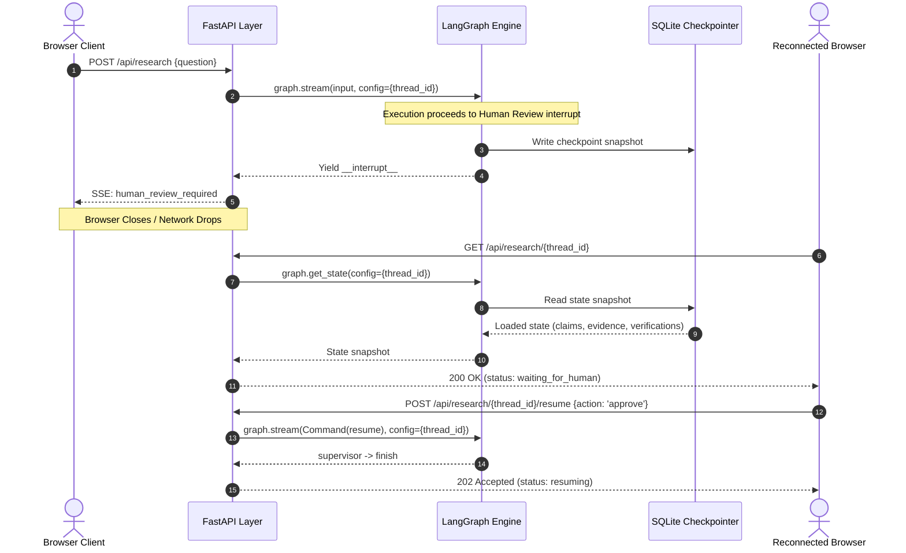

# UI, API & Streaming Architecture

## 1. System Architecture & Boundaries

Phase 14 exposes the Verified Research Agent through a web presentation layer and real-time streaming API while preserving strict architectural boundaries:

```
  ┌─────────────────────────────────────────────────────────────┐
  │                         User / Browser                      │
  │                  (Modern Responsive Web UI)                 │
  └──────────────────────────────┬──────────────────────────────┘
                                 │ HTTP POST/GET (REST)
                                 │ Server-Sent Events (SSE)
                                 ▼
  ┌─────────────────────────────────────────────────────────────┐
  │                        Presentation                         │
  │                  FastAPI Service Layer                      │
  │   - Endpoints: /api/research, /stream, /resume, /health     │
  │   - Authoritative Server-Side Validation                    │
  │   - SSE Event Formatting & Historical Event Buffering       │
  └──────────────────────────────┬──────────────────────────────┘
                                 │ Invocations & Commands
                                 │ Checkpoint State Queries
                                 ▼
  ┌─────────────────────────────────────────────────────────────┐
  │                       LangGraph Engine                      │
  │          Supervisor Orchestration Graph (Compiled)          │
  │   - Durable SQLite / Memory Checkpointers                   │
  │   - Thread Isolation via thread_id                          │
  │   - Execution Interrupts & Resume Commands                  │
  └──────────────────────────────┬──────────────────────────────┘
                                 │ Worker Routing
                                 ▼
  ┌──────────────┐        ┌──────────────┐        ┌──────────────┐        ┌──────────────┐
  │   Research   │        │   Verifier   │        │ Human Review │        │    Writer    │
  │   Subgraph   │        │    Worker    │        │ Worker (HITL)│        │    Worker    │
  └──────────────┘        └──────────────┘        └──────────────┘        └──────────────┘
```

### Architectural Rules
1. **Frontend is Strictly a Presentation Layer**: The frontend code contains zero research logic, verifier evaluation, supervisor decisions, retry policies, or direct checkpoint access.
2. **Backend is the Authoritative Source of Truth**: All critical state transitions, referential integrity checks, claim edits, writer synthesis, and routing validations are executed server-side.
3. **Purity of State Flow**: User actions are submitted to the API as commands; the API routes them to LangGraph, which executes graph transitions and returns state snapshots.
4. **Writer Synthesis Gate**: The Writer node strictly executes only AFTER human approval/edit, strictly using verified/approved claims and direct source evidence with exact citations `[1]`.
5. **Research Workspace Design**: The UI employs a modern, minimal, light-mode research workspace philosophy (Linear/Vercel/Stripe aesthetic) with structured tables, expandable rows, interactive SVG architecture visualizer with slide-over node inspector sheet, and grounded final report hero presentation.

---

## 2. Explicit UI State Model

The frontend and API reject generic boolean loading flags and explicitly model the research lifecycle via 7 discrete states:

| UI State | Description | Graph State Condition | Permitted User Actions |
|---|---|---|---|
| `idle` | System ready for a new query. | No active thread loaded. | Input question, Start Research, Reconnect. |
| `running` | Graph is executing workers. | `state.next` in `('supervisor', 'research', 'verifier')`. | Cancel/Disconnect, view live stream. |
| `waiting_for_human` | Execution paused at human review gate. | `state.next == ('human_review',)` with active interrupt. | Approve, Edit Claims, Request More, Reject. |
| `resuming` | Human action submitted; graph resuming. | Resumption command issued, awaiting next transition. | View live stream. |
| `completed` | Workflow successfully finalized. | `state.next == ()` and `termination_reason == 'COMPLETED'`. | Inspect report, start new research. |
| `failed` | Unrecoverable error occurred. | Exception raised during graph execution. | Inspect sanitized error, retry. |
| `rejected` | Reviewer explicitly rejected research. | `state.next == ()` and `termination_reason == 'REJECTED'`. | Inspect feedback, start new research. |

---

## 3. Structured Event Model

Streaming between backend and frontend utilizes a typed event contract (`AgentEvent`):

```python
class AgentEvent(BaseModel):
    event_type: AgentEventType
    thread_id: str
    node: str | None = None
    timestamp: str  # ISO 8601 UTC
    data: dict[str, Any] = Field(default_factory=dict)
```

### Implemented Event Types

| Event Type | Emitting Component | Trigger Condition | Payload Data (`data`) |
|---|---|---|---|
| `run_started` | `ResearchService` | Initiation of research run. | `{"question": str}` |
| `node_started` | `ResearchService` | Graph or worker node begins execution. | `{"node": str, "message": str}` |
| `node_completed` | `ResearchService` | Graph or worker node finishes execution step. | Summary output dictionary. |
| `supervisor_decision`| `SupervisorNode` | Supervisor selects next worker. | `{"step": int, "next_worker": str, "reasoning": str}` |
| `research_update` | `ResearchSubgraph`| Researcher gathers sources. | `{"sources_count": int, "claims_count": int}` |
| `source_found` | `ResearcherNode` | Search client discovers new source. | `{"source_id": str, "title": str, "url": str}` |
| `analysis_update` | `AnalystNode` | Analyst extracts atomic claims & findings. | `{"claims_count": int, "findings_count": int}` |
| `critic_update` | `CriticNode` | Critic evaluates research quality & gaps. | `{"critique": {...}, "quality_score": float}` |
| `verification_update`| `VerifierNode` | Verifier evaluates claim against evidence. | `{"claim": {...}, "count": int}` |
| `writer_update` | `WriterNode` | Writer synthesizes grounded final report. | `{"title": str, "citations": [...], "answer": str}` |
| `retry` | `ReliabilityLayer`| Transient network/rate-limit error retry. | `{"attempt": int, "delay": float, "error": str}` |
| `human_review_required`| `HumanReviewNode`| Graph hits `interrupt()` review gate. | Review payload: claims, evidence, verification. |
| `human_review_resumed` | `HumanReviewNode`| Human submits resume action. | `{"action": str, "feedback": str \| None}` |
| `run_completed` | `SupervisorNode` | Graph halts at finish (`COMPLETED`). | `{"termination_reason": "COMPLETED"}` |
| `run_failed` | `ResearchService` | Exception raised during execution. | `{"error": str}` (sanitized error message) |
| `run_rejected` | `SupervisorNode` | Reviewer rejects research (`REJECTED`).| `{"reason": str, "feedback": str \| None}` |

---

## 3.1 Real-Time Streaming Bridge Queue

To prevent synchronous batching where events only arrive after the whole graph completes, `ResearchService` implements an asynchronous bridge queue (`asyncio.Queue`):
- Background worker thread executes `graph.stream(...)` and subgraph invocations.
- ContextVar-based event emitter (`emit_live_event`) pushes events immediately via `loop.call_soon_threadsafe(queue.put_nowait, ...)`.
- Async generator in FastAPI yields SSE events with sub-millisecond latency as each worker node progresses.

---

## 4. Streaming Mechanism: Server-Sent Events (SSE)

### Why Server-Sent Events (SSE) Over WebSockets?
1. **Unidirectional Communication**: Graph updates flow strictly from backend to browser. User commands (start, resume) are discrete HTTP POST requests that benefit from standard HTTP semantics and status codes (202 Accepted, 422 Unprocessable Entity).
2. **Native Browser Support**: Native `EventSource` API handles reconnection and transport automatically without heavy client-side libraries.
3. **Firewall & Proxy Compatibility**: SSE operates over standard HTTP/HTTPS (`text/event-stream`), avoiding WebSocket handshake failures across corporate proxies.
4. **Historical Event Replay**: The `ResearchService` maintains an in-memory event buffer per thread. When an SSE connection opens, it immediately replays historical events before streaming live chunks, preventing race conditions.

---

## 5. Human-in-the-Loop Review Actions

When the graph interrupts at `human_review_node`, execution halts and persists state to the checkpointer. The UI provides 4 distinct review actions:

### 1. Approve
- **Trigger**: Reviewer confirms findings are accurate and grounded.
- **Backend Flow**: Resumes with `Command(resume={"action": "approve"})`.
- **Supervisor Outcome**: Routes to `finish` with status `COMPLETED`.

### 2. Edit Claims
- **Trigger**: Reviewer corrects phrasing or clarifies specific claims.
- **Authoritative Server Validation**:
  - Validates `edited_claims` against Pydantic `Claim` schema.
  - Checks referential integrity via `validate_edited_claims()`.
  - Ensures every cited `evidence_id` exists in the thread's preserved evidence.
  - If invalid (e.g. phantom evidence reference), rejects with `422 Unprocessable Entity` without corrupting state.
- **Supervisor Outcome**: Replaces claims in state, routes to `finish` with status `COMPLETED`.

### 3. Request More Research
- **Trigger**: Reviewer identifies gaps or requests deeper exploration.
- **Backend Flow**: Resumes with `Command(resume={"action": "research_more", "feedback": str})`.
- **Supervisor Outcome**: Resets verification results, increments `human_research_cycles`, and routes back to `research_subgraph`. Enforces hard cap at `MAX_HUMAN_REVIEW_CYCLES` (2).

### 4. Reject
- **Trigger**: Reviewer determines research is flawed, ungrounded, or unacceptable.
- **Backend Flow**: Resumes with `Command(resume={"action": "reject", "feedback": str})`.
- **Supervisor Outcome**: Terminates immediately with `supervisor_termination_reason = "REJECTED"`. Never reports successful completion.

---

## 6. Checkpoint Persistence & Session Reconnection



---

## 7. Claim-Evidence-Source Traceability UI

The user interface explicitly surfaces evidential grounding rather than presenting claims as unquestioned truth:

```
┌────────────────────────────────────────────────────────────────────────┐
│ [claim_001] Transmon qubits demonstrated 1.5ms coherence.              │
│                                           ✓ SUPPORTED (98% Confidence) │
├────────────────────────────────────────────────────────────────────────┤
│ Rationale: Direct textual grounding in src_001 experimental table.    │
├────────────────────────────────────────────────────────────────────────┤
│ GROUNDING TRACEABILITY                                                 │
│ ┌────────────────────────────────────────────────────────────────────┐ │
│ │ "Superconducting transmon qubits achieved coherence times          │ │
│ │  exceeding 1.5 milliseconds."                                      │ │
│ │ Evidence ID: ev_001 | Source: Quantum Coherence Dynamics           │ │
│ │ URL: https://arxiv.org/abs/quant-coherence                         │ │
│ └────────────────────────────────────────────────────────────────────┘ │
└────────────────────────────────────────────────────────────────────────┘
```

---

## 8. Security & Secret Protection

1. **Credential Isolation**: No environment variables, LLM API keys (`GROQ_API_KEY`, `TAVILY_API_KEY`), or LangSmith tokens (`LANGSMITH_API_KEY`) are exposed in API schemas or static frontend assets.
2. **Error Sanitization**: All error messages emitted via `run_failed` or `ResearchStateResponse.error` pass through `sanitize_error_message()`, which strips raw tokens, API keys, and sensitive parameters.
3. **Authoritative Input Validation**: Pydantic models with `extra="forbid"` prevent malicious field injection.

---

## 9. Limitations & Known Tradeoffs

1. **Single-Worker Event Buffering**: The in-memory event buffer per thread is scoped to the active application process. In multi-instance cluster deployments, an external message bus (e.g. Redis Pub/Sub) would be required to broadcast SSE across replicas.
2. **Static SPA Packaging**: The single-page UI is embedded directly as vanilla HTML5/CSS/JavaScript without external build pipelines (Vite/Webpack) to ensure seamless zero-dependency deployment and offline operation.
