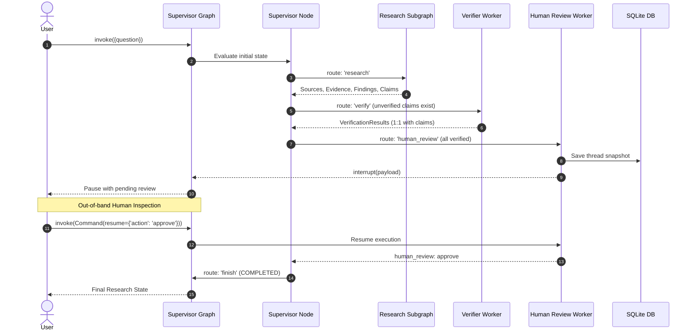

# Production-Style Testing Strategy & Invariant Hardening

## 1. Executive Summary & Purpose

Phase 13 establishes a rigorous, production-grade test strategy and suite for the **Verified Research Agent**. Rather than testing isolated Python functions in artificial silos, this test framework evaluates the system as an **integrated stateful directed acyclic and cyclic graph**.

The suite systematically verifies:
- End-to-end multi-agent graph routing and conditional branching.
- Cyclic feedback loops and deterministic bounding bounds.
- Multi-worker orchestration under the Centralized Supervisor architecture.
- Structural and referential state integrity across the entire evidence citation graph.
- Semantic claim-level verification across 10 distinct evidential verdict and mismatch scenarios.
- Human-in-the-Loop (HITL) review actions (`approve`, `edit`, `research_more`, `reject`) and interrupt/resume lifecycles.
- Checkpoint persistence and disaster recovery across real OS process boundaries.
- Contextual research reuse, multi-turn follow-up queries, and temporal drift detection.
- Transient fault resilience, exponential backoff, fast-failure on non-retryable errors, and chaos injection.
- Security against architectural bypass attempts and state corruption.

All tests operate completely **offline and deterministically**, utilizing injected protocol mocks and test doubles with zero external network dependencies or live API calls (e.g. Tavily, Groq).

---

## 2. Integrated Stateful Graph vs Isolated Unit Tests

```
+---------------------------------------------------------------------------------------+
|                                Traditional Unit Testing                               |
|   [test_analyst.py]          [test_critic.py]           [test_researcher.py]         |
|   mock state -> func -> dict    mock state -> func -> dict  mock state -> func -> dict|
|   ❌ Does not test transitions, reducers, persistence, interruptions, or graph edges   |
+---------------------------------------------------------------------------------------+
                                           ▼
+---------------------------------------------------------------------------------------+
|                           Production Stateful Graph Testing                           |
|                                                                                       |
|                                      START                                            |
|                                        │                                              |
|                                        ▼                                              |
|                                 ┌──────────────┐                                      |
|                 ┌───────────────┤  Supervisor  │◄────────────────┐                    |
|                 │               └──┬─────────┬─┘                 │                    |
|                 ▼                  ▼         ▼                   │                    |
|          ┌──────────────┐    ┌──────────┐  ┌──────────────┐      │                    |
|          │ Research     │    │ Verifier │  │ Human Review │──────┘                    |
|          │ Subgraph     │    │ Worker   │  │ (Interrupt)  │                           |
|          └──────┬───────┘    └────┬─────┘  └──────────────┘                           |
|                 │                 │                                                   |
|                 └─────────────────┴───────────────────────────────┘                   |
|                                        │                                              |
|                                  (All workers)                                        |
|                                        ▼                                              |
|                                       END                                             |
|                                                                                       |
|   ✔ Validates node transitions, reducer accumulation, state persistence, interrupts,  |
|     process restarts, fault injection, invariant overrides, and cycle bounding.      |
+---------------------------------------------------------------------------------------+
```

### Why Graph-Level Testing is Essential for Agentic Systems
1. **Dynamic Execution Topologies**: The execution path is not hardcoded; it is determined dynamically by state conditions and supervisor evaluations.
2. **State Reducer Dynamics**: LangGraph nodes modify shared state using reducers (e.g. accumulating `sources` and `evidence`). Testing isolated functions cannot verify whether state accumulates monotonically or accidentally overwrites historical context.
3. **Interrupt and Resume Lifecycles**: Human review requires compiling graph interrupts with durable checkpointers. Testing require verifying state preservation before, during, and after pausing.
4. **Process Boundary Invariance**: Production deployments crash or restart. Only graph tests executing across real OS subprocesses can verify database checkpoint durability.

---

## 3. The 9 Core System Invariants

The Verified Research Agent enforces 9 inviolable architectural invariants:

| # | Invariant | Description | Enforcement Mechanism | Failure Mode Prevented |
|---|-----------|-------------|-----------------------|------------------------|
| **1** | **Claim-Evidence-Source Traceability** | Every claim cites valid `evidence_ids`; every evidence cites a valid `source_id`. All IDs are unique. | `validate_traceability()` in [`models/traceability.py`](file:///d:/research-agent/src/verified_research/models/traceability.py) & node hooks | Hallucinated citations, phantom evidence, ungrounded assertions |
| **2** | **Verification Coverage** | 100% of claims in state must be verified by `verifier` before review or finish. | `validate_supervisor_decision()` & `DeterministicSupervisorPolicy` | Unverified claims leaking to human review or final report |
| **3** | **Human-in-the-Loop Gate** | Execution cannot reach terminal `finish` without explicit human review approval or edit. | Supervisor invariant validation guard | Autonomous publishing without human authorization |
| **4** | **Bounded Research Loop** | Research Subgraph critic loop cannot exceed `MAX_RESEARCH_LOOPS` (3). | `route_after_critic()` in [`graph/router.py`](file:///d:/research-agent/src/verified_research/graph/router.py) | Infinite research cycles wasting API quota and tokens |
| **5** | **Bounded Human Cycles** | Human `research_more` requests cannot exceed `MAX_HUMAN_REVIEW_CYCLES` (2). | `route_after_human_review()` & `validate_supervisor_decision()` | Infinite human-in-the-loop review loops |
| **6** | **Bounded Supervisor Loop** | Supervisor iterations cannot exceed `MAX_SUPERVISOR_STEPS` (8). | `create_supervisor_node()` & `route_after_supervisor()` | Runaway supervisor dispatch loops |
| **7** | **Bounded Retries** | Transient failures back off and retry at most `MAX_RETRIES` (3). | `RetryPolicy` & `execute_with_retry()` in [`reliability/policy.py`](file:///d:/research-agent/src/verified_research/reliability/policy.py) | Cascading thread starvation under upstream outages |
| **8** | **Valid Routing Destinations** | Graph routing decisions strictly target valid worker nodes: `research`, `verify`, `human_review`, `finish`. | `SupervisorDecision` schema validation & `route_after_supervisor()` | Execution stalls, routing crashes, or unauthorized node dispatch |
| **9** | **Rejection Terminal State** | Human rejection terminates immediately with status `REJECTED` (never `COMPLETED`). | Supervisor node termination reason evaluation | Presenting rejected research as verified or completed |

---

## 4. Test Suite Taxonomy & Organization

The production test suite resides in [`tests/production/`](file:///d:/research-agent/tests/production/):

```
tests/production/
├── conftest.py                             # Reusable deterministic fixtures, spy services, mock factories
├── test_system_happy_path.py               # Full end-to-end integration (START -> ... -> Interrupt -> Finish)
├── test_invariants.py                      # Dedicated validation for all 9 Core System Invariants
├── test_research_loop.py                   # Single-pass, multi-pass refinement, and hard cycle cap (<=3)
├── test_supervisor_orchestration.py        # Supervisor policy routing, worker dispatch, step bounds (<=8)
├── test_verifier_integration.py            # 10 semantic verdict/mismatch cases + 1:1 coverage parity
├── test_hitl_workflows.py                  # Approve, edit (valid/invalid), research_more, and reject
├── test_checkpoint_process_boundary.py     # Subprocess A (pause) -> Subprocess B (recover & finish)
├── test_follow_up_workflows.py             # Sufficiency evaluation, context reuse, temporal mismatch
├── test_reliability_fault_injection.py     # Rate limiting (429), mixed transients, auth fail-fast, retry cap
└── test_state_corruption_and_bypass.py    # Schema corruption, duplicate IDs, and bypass interception
```

---

## 5. State Machine & Lifecycle Verification

### Happy-Path Execution Flow


---

## 6. Checkpoint Persistence & Cross-Process Isolation Verification

Durable checkpointing is validated in [`test_checkpoint_process_boundary.py`](file:///d:/research-agent/tests/production/test_checkpoint_process_boundary.py) via real OS subprocess isolation:

1. **Process A (OS Process 1)**:
   - Configures `create_supervisor_graph` with a temporary `sqlite_checkpointer`.
   - Runs `graph.invoke({"question": "What is superconducting coherence time?"}, config)`.
   - The graph progresses through Supervisor -> Research -> Verifier -> Human Review.
   - Human Review triggers `interrupt()`.
   - SQLite writes state snapshots to disk.
   - Process A asserts interruption and exits cleanly (`sys.exit(0)`).
2. **Process Boundary Separation**:
   - Memory is completely cleared; Python interpreters terminate.
   - Test verifies database file exists and is populated on disk.
3. **Process B (OS Process 2)**:
   - Spawns in an independent Python process using `sys.executable`.
   - Re-connects to the identical SQLite database with the same `thread_id`.
   - Instantiates `create_supervisor_graph` with fail-safe mock workers that raise `RuntimeError` if research or verifier are re-executed.
   - Inspects `graph.get_state(config)`: verifies `next == ("human_review",)`, claims and verification results are identical.
   - Executes `graph.invoke(Command(resume={"action": "approve"}), config)`.
   - Execution resumes directly at Human Review, transitions to Supervisor, and finishes at `END` with `supervisor_termination_reason == "COMPLETED"`.

---

## 7. Adversarial, Fault Injection, & Bypass Hardening

### Architectural Bypass Prevention
When an LLM supervisor policy hallucinates or attempts an illegal shortcut:
- **Bypassing Verifier**: If unverified claims exist and the policy returns `human_review` or `finish`, `validate_supervisor_decision()` overrides `next_worker` to `"verify"`.
- **Verifying Without Claims**: If claims are empty and the policy returns `verify`, it is overridden to `"research"`.
- **Rogue Worker Target**: If an arbitrary worker name (e.g. `"writer"`) is injected, `route_after_supervisor()` catches the unknown name, logs an error, and safely defaults to `"finish"`.

### Fault Injection & Error Classification
- **Transient Rate Limit (429)**: Backs off exponentially, adds optional jitter, sleeps, and succeeds on subsequent attempts.
- **Transient Sequence**: Handles multi-fault cascades (429 -> 503 -> Timeout -> Success) without aborting.
- **Permanent Non-Retryable Error (401 / 400)**: Fails fast on attempt 1 without sleeping or retrying.
- **Retry Exhaustion**: Halts after `max_attempts` (e.g. 3 or 4) and wraps the underlying exception into a structured `MaxRetriesExceededError` with full `ErrorInfo` metadata.

---

## 8. Multi-Turn & Follow-Up Sufficiency Verification

Follow-up query routing is evaluated across three primary dimensions:
1. **Scope Sufficiency (REUSE)**:
   - Prior research contains full context for follow-up question.
   - `HeuristicSufficiencyService` computes semantic keyword and entity overlap.
   - Outcome: `ResearchReuseDecision(decision="REUSE")`.
   - Pipeline / Supervisor routes directly to synthesis/verification, completely bypassing search API calls.
2. **Scope Deficiency (RESEARCH_MORE)**:
   - Follow-up question requests concepts completely absent from prior context.
   - Outcome: `ResearchReuseDecision(decision="RESEARCH_MORE")`.
   - Routes to `research` subgraph to execute targeted searches.
3. **Temporal Drift (RESEARCH_MORE)**:
   - Prior context contains valid facts from 2024.
   - Follow-up question asks for 2026 data.
   - Evaluator identifies temporal discrepancy and forbids stale reuse, triggering fresh search.

---

## 9. Production CI/CD Test Execution Guidelines

To run the complete test suite locally or in CI/CD pipelines:

```bash
# Run the complete production test suite
pytest tests/production/ -v

# Run the complete test suite (unit, integration, and production)
pytest -v

# Run invariant tests specifically
pytest tests/production/test_invariants.py -v

# Run cross-process checkpoint recovery specifically
pytest tests/production/test_checkpoint_process_boundary.py -v
```

### Performance Profile
- **Total Test Count**: 290 tests across 18 test modules.
- **Execution Time**: ~25-30 seconds for the entire repository.
- **Network Profile**: 100% offline, zero live network calls.
- **Deterministic**: 100% reproducible across operating systems (Linux, macOS, Windows).

---

## 10. System Invariant Matrix & Verification Mapping

| Invariant | Test File | Test Method(s) | Verification Assertion |
|---|---|---|---|
| **Claim-Evidence-Source Traceability** | `test_invariants.py`<br>`test_state_corruption_and_bypass.py` | `test_invariant_1_claim_evidence_source_traceability`<br>`test_dangling_evidence_in_claim_rejected` | `validate_traceability()` raises `UnknownEvidenceError` or `UnknownSourceError` |
| **Verification Coverage (100%)** | `test_invariants.py`<br>`test_supervisor_orchestration.py` | `test_invariant_2_complete_verification_coverage`<br>`test_state_driven_progression_logic` | `policy.evaluate()` routes to `verify` whenever unverified claims exist |
| **Human-in-the-Loop Gate** | `test_invariants.py`<br>`test_system_happy_path.py` | `test_invariant_3_human_in_the_loop_gate`<br>`test_full_system_happy_path_with_approval` | State pauses at `human_review` interrupt; never reaches `finish` directly |
| **Bounded Research Loop (<=3)** | `test_invariants.py`<br>`test_research_loop.py` | `test_invariant_4_bounded_research_loop`<br>`test_hard_cap_iteration_limit` | `route_after_critic()` returns `end` at `research_iteration >= 3` |
| **Bounded Human Review (<=2)** | `test_invariants.py`<br>`test_hitl_workflows.py` | `test_invariant_5_bounded_human_review_cycles`<br>`test_hitl_research_more_workflow_and_cycle_cap` | `route_after_human_review()` returns `end` at `human_research_cycles >= 2` |
| **Bounded Supervisor Steps (<=8)**| `test_invariants.py`<br>`test_supervisor_orchestration.py`| `test_invariant_6_bounded_supervisor_loop`<br>`test_supervisor_loop_hard_boundary_in_compiled_graph` | Decision set to `finish`, termination reason `MAX_SUPERVISOR_STEPS_REACHED` |
| **Bounded Retries (<=3)** | `test_invariants.py`<br>`test_reliability_fault_injection.py` | `test_invariant_7_bounded_retries`<br>`test_max_retries_exhaustion_raises_typed_error` | Raises `MaxRetriesExceededError` after `max_attempts` |
| **Valid Routing Destinations** | `test_invariants.py`<br>`test_state_corruption_and_bypass.py` | `test_invariant_8_valid_routing_destinations`<br>`test_unauthorized_worker_name_tampering_routed_safely_to_finish` | Invalid workers rejected by Pydantic; tampered workers default to `finish` |
| **Rejection Terminal State** | `test_invariants.py`<br>`test_hitl_workflows.py` | `test_invariant_9_rejection_terminal_status`<br>`test_hitl_reject_terminal_workflow` | `supervisor_termination_reason == "REJECTED"`, research worker not re-invoked |
